# POČÍTAČOVÉ SÍTĚ

## Přehled

1. [Základní pojmy a paradigmata](#základní-pojmy-a-paradigmata)
2. [Taxonomie počítačových sítí](#taxonomie-počítačových-sítí)
3. [Vrstvy a vrstvové modely](#vrstvy-a-vrstvové-modely)
4. [Techniky přenosu dat](#techniky-přenosu-dat)
5. [Síťová vrstva a směrování](#síťová-vrstva-a-směrování)
6. [Transportní vrstva a protokoly](#transportní-vrstva-a-protokoly)
7. [Internetworking](#internetworking)
8. [Adresy a adresování](#adresy-a-adresování)
9. [Protokoly IPv4 a IPv6](#protokoly-ipv4-a-ipv6)

## Základní pojmy a paradigmata

Zpět na [Přehled](#přehled).

### (A01) Proudové a blokové přenosy

Odpověď na otázku _*V jaké formě budou data posílaná?*_

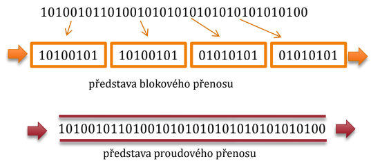

#### Proudové přenosy

Posíláme **souvislý nestrukturovaný** proud (sekvenci) dat, po jednotlivých symbolech (bits, bytes, words).

Vlastnosti:

- Zachovává pořadí (princip FIFO fronty)
- Vhodnější pro dvou-bodová spojení

Příklady:

- L1: Ethernet (bits), Wi-fi (words),
- L4: TCP (bytes)

#### Blokové přenosy

Data rozdělíme na vhodně velké celky (bloků)

- fixní velikost bloků (nepkratické)
- proměnná velikost bloků (typicky s horním omezením, může být i spodní)

Blok je strukturovaný - header, body, footer

Vlastnosti:

- nemusí být zachované pořadí bloků
- bloky po sobě ani nemusí bezprostředně následovat (mohou být prodlevy)
- bloky často obsahují metadata (adresa odesílatele v případě poruchy, adresa příjemce, pořadí bloků pro zpětné sestavení, identifikace přenosu pro umožnění více přenosů zároveň)

Terminologie bloků podle vrstev:

- L2: rámce (ethernet), buňky (ATM)
- L3: datagramy (IPv4), pakety (IPv6)
- L4: segmenty (TCP), datagramy (UDP)
- L7: zprávy (HTTP)

#### Kombinace obou přístupů

- posílání bloků proudem (framing)
- posílání bloků jinými bloky (encapsulation)
- posílání proudů bloky

### (A02) Spojované a nespojované přenosy

Odpověď na otázku _*Musíme se domluvit na přenosu dopředu?*_

#### Spojované

Komunikující strany se musí dohodnout na navázání/udržení/přerušení spojení. Pořadí dat musí být zachováno → přenos dat probíhá po trase vytyčené při navazování spojení.

Navázání spojení zahrnuje: obě strany existují, jsou schopny se najít, souhlasí se spojení, domluví se na parametrech přenosu (alokace zdroj, vytyčení cesty...)

Příklady:

- L2: ATM
- L4: TCP (spojovaný, ale iluze, protože L3 není)
- L7: HTTP, SMTP, POP3 (protože používají TCP)

Přenos má stavový charakter:

- komunikuji/nekomunikuji
- je třeba se vyhnout dead lockům (jedna strana považuje spojení za navázané a druhá nikoli)
- je třeba detekovat a řešit nestandartní situace (př. výpadek spojení)

#### Nespojované

Odesílání jednotlivých zpráv (tzv. _datagramů_). Pořadí dat není zachované (analogie s poštou, pošlu tři dopisy, každý může dojít jindy).

Není navázáno spojení (příjemce ani nemusí existovat) → Datagram musí obsahovat kompletní identifikaci přijemce. Bezstavový charakter komunikace. Každý datagram cestuje nezávisle.

Příklady:

- L2: Ethernet
- L3: IP, ICMP
- L4: UDP

### (A03) Přepojování okruhů a paketů

Odpověď na otázku _*Jak se data dostanou k příjemci*_

#### Přepojování okruhů

První vytvoříme souvislý okruh, přes který se posílají data. Najde se a vytyčí se cesta (fyzicky nebo virtuálně)

Vlastnosti:

- přenos musí být spojovaný
- Iluze přímého spojení s protistranou
- Nízká (konstantní) latence (hledání cesty pouze jednou na začátku)
- zachovává pořadí
- v okruhu máme vyhrazenu exkluzivní kapacitu → garantované přenosy
- podporuje proudové i blokové přenosy
- podporuje spolehlivé i nespolehlivé přenosy
- využití v telekomunikacích

#### Přepojování paketů

Pro každý blok dat se najde cesta zvlášť. Po cestě prochází skrz přepojovací uzly (switche, routery). Uzel má buffery pro příchozí a odchozí data (mechanismus Store&Forward) → přijme blok a umístí ho do příchozího bufferu → CPU postupně zpracovává bloky z příchozího bufferu → vybere blok, vybere mu nový směr a dá ho do odpovídajícího odchozího bufferu → zpracovaný blok čeká v odchozím bufferu na odeslání

Vlastnosti:

- odolné vůči chybám
- princip fungování počítačových sítí
- přenos musí být blokový → metadata musí obsahovat adresu příjemce a odesílatele
- Kapacita cest a přepojovacích uzlů je omezená a sdílená
  - dostupná kapacita může být nedostatečná a nadbytečné bloky mohou být zničeny!
- vyšší latence (náročný proces v uzlech)
  - je proměnlivá - závisí na aktuální vytíženosti cest a uzlů
- může fungovat jak spojovaně tak nespojovaně (virtuální okruhy vs datagramová služba)

### (A04) Virtuální okruhy a datagramová služba

#### virtuální okruhy

Přepojování paketů pomocí spojovaného přenosu. Virtuálně (ne fyzicky jako u přepojování okruhů) se vytyčí cesta (VCI - virtual circuit identifier - identifikátor přidělený cestě), jednotlivé přepojovací prvky si pamatují cestu. Bloky v sobě nesou ID okruhu a všechny jsou směrovány po tomto jednom okruhu. př. ATM na L2

#### Datagramová služba

Posílání paketů nespojovaným přenosem. př. Ethernet na L2

### (A05) Spolehlivé přenosy a nespolehlivé přenosy

Odpověď na otázku _*Jakou úroveň spolehlivosti přenosu požadujeme?*_

#### Spolehlivé

Přenos má povinnost zajistit spolehlivost.

- Detekce chybových situací: [paritní bity](#b46-kontrola-parity), [kontrolní součty](#b47-kontrolní-součty), [CRC](#b48-cyklické-redundantní-součty)
- řešení chybových situací: [samoopravné kódy](#b45-detekce-poškozených-bloků), [opakovaný přenos](#b49-potvrzovací-strategie)

Následky:

- narušení plynulosti (při chybách)
- větší množství zpráv (acknowledgments a nutnost znovuposílání)
- větší zprávy (kvůli zabezpečovacím údajům)
- vyžaduje vyšší přenosovou a výpočetní kapacitu
- neexistuje absolutní spolehlivost

Příklad: TCP (L4)

#### Nespolehlivé

Když dojde k chybě, nebudeme ji řešit (chyby ale nevytváříme cíleně :D)

- tam kde je důležitější pravidelnost a latence, než přesnost

Příklady: UDP (L4), IP (L3), Ethernet (L2), ATM (L2)

### (A06) Garantované a negarantované služby

Odpověď na otázku _*Bude po celou dobu dostupný dostatek zdrojů?*_

#### Garantované

Garance dostatečného možství zdrojů (přenosová a výpočetní kapacita) po celou dobu přenosu. Zdroje jsou zajištěny dopředu při navazování spojení (exkluzivní kapacita) - zabere se prostor pro maximální očekávanou zátěž - často nevyužita kapacita (nemůže být využita nikým jiným) → drahé a neefektivní. Realizace vždy pomocí přepojování okruhů.

#### Negarantované

Negarantované - jednodušší a efketivnější (škálováno na průměrnou zátěž). Při vyšším zatížení můžou dojít zdroje - zaplní se buffery, nebo procesor - některé pakety musí být zahozeny (jaké?)

### (A07) Princip Best Effort a Quality of Service

Jaké pakety zahodit, když dojdou zdroje u negarantovaných přenosů?

- Best effort
  - pakety jsou doručovány tak dlouho, jak je to možné. Pokud doručení není možné, začnou se zahazovat náhodně
  - př. IP (L3), Ethernet (L2), ATM (L2)
- Quality of Service (QoS)
  - cokoliv, co není best effort
  - relativní QoS - princip prioritizace, jako první zahazujeme data s menší prioritou
  - absolutní QoS - musíme dopředu zarezerovat zdroje. Pokud není kapacita, musí se rezervace odmítnout a tudíž nemůže dojít k přenosu (podobné jako přepojování paketů)

### (A08) Svět telekomunikačních a počítačových sítí

| Telekomunikační sítě                                          | Počítačové sítě                                                               |
| ------------------------------------------------------------- | ----------------------------------------------------------------------------- |
| chytrá síť, hloupé koncové uzly                               | hloupá síť, chytrá koncová zařízení                                           |
| síť je drahá, mohutná, neflexibilní                           | síť je levná, jednoduchá, flexibilní                                          |
| přepojování okruhů                                            | přepojování paketů                                                            |
| spojované, spolehlivé, garantované přenosy                    | nespojované, nespolehlivé, negarantované přenosy                              |
| limitované zdroje - prodej exkluzivní rezervace zdrojů        | nedostatek zdrojů není hlavní problém - nejdůležitější jsou technické faktory |
| vlastník není koncový uživatel                                | vlastník je většinou uživatel                                                 |
| pouze jeden účel - broadcast (tv, radio), přepínané (telefon) | nutnost řešit problém s kompatibilitou                                        |

### (A09) Hospodaření se zdroji

- Moore's law - každé dva roky se zdvojnásobí výkon (počet tranzistorů na mm) (postupně se zpomaluje, původně to bylo co rok).
  - Z moorova zákona vyplývá, že každé dva roky máme srovnatelnou výpočetní sílu za poloviční cenu
- Gilder's law - přenosová kapacita cest se každý rok ztrojnásobuje
- Disk law - uložná kapacita se každý rok přibližně zdvojnásobí

## Taxonomie počítačových sítí

Zpět na [Přehled](#přehled).

### (A10) Distribuční sítě a sítě s přepojováním

#### Distribuční sítě

přenosy 1:N (1 vysílá, N přijímá), neřešíme směrování (data patří všem), př. televize a radia

technologie:

- DVB (digital video broadcasting) - př. DVB-T2
- DAB (digital audio broadcasting)

#### Sítě s přepojováním

přenosy 1:1 (řešíme routování a přeposílání)
možné varianty:

- [přepojování okruhů](#přepojování-okruhů)
- [přepojování paketů](#přepojování-paketů)

### (A11) Pevná a mobilní telefonní síť

#### Pevná telefonní síť

- [páteřní část](#páteřní-transportní-sítě) - hierarchie telefonních ústředen (2 mezinárodní → k nim připojených 6 tranzitních → k nim 138 řídících → z nich 2374 předsunutých tzv. RSU)
- [přístupová část](#přístupové-sítě)
  - POP - lokální ústředny/RSU s hlavním rozvaděčem
  - z POP kroucené dvoulinky dlouhé max 5 km do všech CP
  - CP - domy, kanceláře
- dnes např. síť O2

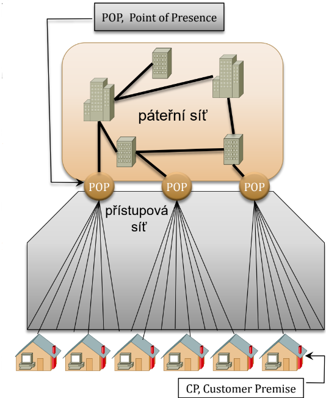

#### Mobilní telefonní síť (GSM)

- [Páteřní část](#páteřní-transportní-sítě) - Network switching subsystem (NSS) - provádí spojení mezi účastníky jiných sítí
- [přístupová část](#přístupové-sítě) - základem je systém základnových stanic (BSC). Tyto stanice řídí několik BTS stanic (v řádu desítek). BTS stanice propojuje koncového uživatele (telefon) se zbytkem sítě. V případě pohybu uživatele řídí BSC předávání hovoru mezi BTS. Uzemí, které je pokryto signálem mobilní sítě je rozděleno na malé oblasti (tzv. buňky - cells), Každou buňku obsluhuje jedna BTS. BTS může mít více antén (každá s vlastní frekvencí, každá frekvence pro jeden sektor, BTS tedy může spravovat i více sektorů, aniž by se sektory vzájemně rušily)
- dnes např. T-mobile

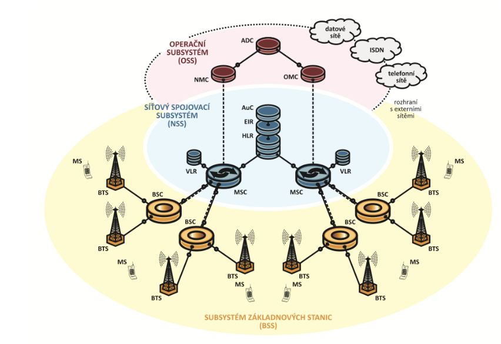

### (A12) Páteřní a přístupové sítě

#### Páteřní (transportní) sítě

Propojuje na velké vzdálenosti hlavní komponenty celé infrastruktury. Tvořena malým počtem uzlů, většinou propojených optickými vlákny

#### Přístupové sítě

umožňuje připojení koncových uživatelů do páteřní sítě

- point of presence (POP) - místo propojení páteřní a přístupové sítě
- customer premises (CP) - místo, kde se mohou vyskytovat potenciální zákazníci

vlastnosti:

- pokrývají celé území (musí vést ke všem potenciálním zákazníkům, když ji buduji)
- vede skrz veřejná místa (musím rozkopat ulici, abych mohl položit kabel), tudíž drahé a musím plánovat dlouho dopředu
  - při budování používám aktuálně nejmodernější technologie
  - vždy naddimenzovávám (když by mi stačilo 10 kabelů, tak položím 100 kabelů)

"poslední míle" (z pohledu operátor "první míle") - propojení mezi koncovým uživatelem a koncovým bodem telefonní sítě

### (A13) Překryvné přístupové sítě

Využiji existující infrastrukturu, kterou modifikuji (použití jiné frekvence nebo zapouzdření dat) a vybuduji na ní vlastní infrastrukturu. Původní funkčnost je zachovaná.

- [fixní telefonní sítě](#a14-technologie-xdsl)
- [elektrické sítě](#a15-technologie-plc)
- [síť kabelové televize](#a16-technologie-docsis)

### (A14) Technologie xDSL

Digital Subscriber Line - využití struktury původních pevných telefonních sítí POTS. POTS používali omezenou frekvenci (pouze pro přenos hlasu po kroucené dvoulince). Způsob překrytí - data budeme přenášet po stejné dvoulince ale pro přenos dat použijeme vyšší frekvenci (frekvenční multiplex). Největší problém je přenos na velkou vzdálenost

Technické řešení:

- CP část:
  - DSL modem - k modemu jsou připojení uživatelé (počítače) - mění digitální data na analogový signál
  - splitter - odděluje/spojuje nižší frekvence (hlas) od vyšších (data) - místo, kde se spojí připojený telefon (stará síť) a DSL modem (s novými počítači) → jedním kabelem vede data do přípojky a z přípojky dál do POP

- POP část - přijde směs dat a hlasu
  - DSLAM (DSL Access Multiplexer) - zařízení v POP, které obdrží směs vyšších a nižších frekvencí → rozdělí je → nižší frekvence jdou do telefonní ústředny, vyšší frekvence do routeru

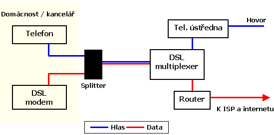

Čím vyšší frekvence, tím náročnější přenos - s větší frekvencí se snižuje přenosová vzdálenost → vznik předsunutých ústředen (zkrácení vzdálenosti). Podle frekvence pak rozlišujeme použité technologie př. ADSL (Asymetric Digital Subscriber Line), VDSL2 (Very High-Speed Digital Subscriber Line)

### (A15) Technologie PLC

Power-Line Communication - překrytí původní elektrické sítě (napětí 230V a frekvence 50Hz). Data přenášíme na vyšší frekvenci (frekvenční multiplex)

problémy:

- různé standardy v různých zemích (110V, 120V, 60Hz atd.)
- na sloupech vyskového napětí nejsou kabely stíněné a fungují jako antény
- rušení vyzařovanými signály prostředí
- rušení i v domácnosti (vypnutí/zapnutí spotřebiče...)

Kdy tedy (ne)lze použít?

- PLC lze využít na velké vzdálenosti → nízká frekvence → nízké přenosové rychlosti. Použití pro monitorování údržby sítě
- Last mile - drahé a nepoužívané
- Last Meter - vnitřní rozvody za domácím elektroměrem → lze využít pro tvorbu LAN (až 500 Mb/s)

### (A16) Technologie DOCSIS

kabelová televize - televize připojena pomocí koaxiálního kabelu pro analogový jednosměrný přenos → chceme přenášet data skrz analogové kanály (technologie DOCSIS) v obou směrech (nutno zřídit zpětný kanál). Přístupovou část tvoří kombinace koaxiálních kabelů a optiky (HFC).

prvky překryvné sítě:

- CMTS - analogicky jako DSLAM
  - mezi CMTS a CP leží optický uzel
  - z optického uzlu směrem k CMTS vede optické vlákno
  - z optického uzlu směrem k CP vede koaxiální kabel
- u CP je Cable Modem (CM), který uvede vše do provozu

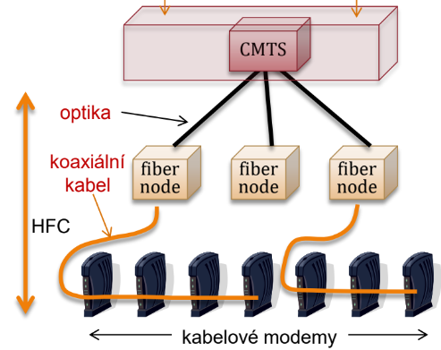

### (A17) Technologie FTTx

obecné označení pro oblast sítě, která využívá optická vlákna na poslední míli připojení. `x` udává, jak blízko k užvateli jdu:

- FTTH - home
- FTTB - building
- FTTC - curb (obrubník)
- FFTN - node - využívá DOCSIS v HFC

obecně dělíme na:

- Aktivní - v rámci infrastruktury využívají aktivní síťové prvky (rozbočování, zesilování...) zapojené do elektřiny. Vyšší přenosová kapacita, větší vzdálenost
- Pasivní - zakopané pasivní elementy - na kratší vzdálenost

### (A18) Datové sítě

hloupá síť, chytrá koncová zařízení - jediný účel sítě je přenést data.

Vlastnosti:

- možné přepojování okruhů i paketů
- používá Best Effort i QoS
- podle vztahu vlastník + uživatel je dělíme na [privátní](#soukromé-datové-sítě), [veřejné](#veřejné-datové-sítě) a [virtuální privátní](#virtuální-privátní-datové-sítě)

#### Soukromé datové sítě

= uživatel je vlastník (vybudoval ji sám pro sebe)

výhody:

- majitel rozhoduje o všech technologiích, protokolech, adresách, ...

nevýhody:

- drahé - typicky buduje stát (u nás vybudovalo ministerstvo obrany, využívají ho datové schránky, IZS...)

#### Veřejné datové sítě

Telekomunikační operátor vybuduje veřejnou datovou síť a nabízí ji zákazníkům za poplatek (cena podle množství přenesených dat) - vlastník není zamýšleným uživatelem. Je třeba kvalitní a podrobná dokumentace, jak se připojit.

výhody:

- výhodné pro malé subjekty
- flexibilní - využívá službu, není to investice

nevýhody (pro zákazníka):

- sdílena všemi uživateli (bezpečnost)
- o všem rozhoduje vlastník

#### Virtuální privátní datové sítě

Kombinace předchozích - sdílená veřejná infrastruktura, navozujeme iluzi samostatných sítí oddělených od sebe (uživatelé se navzájem nevidí)

výhody:

- levnější
- nezávislost - nejdůležitější určí majitel (technologie, protokoly, ...), o zbytku rozhoduje uživatel (oprávění, ...)

### (A19) Sítě PAN, LAN, MAN, WAN

#### Personal Area Networks

1-10m - propojení zařízení v pracovním prostoru jednoho člověka (propojení monitoru, klávesnice, počítače, sluchátek, tiskárny, ...)

#### Local Area Networks

10m-1km - propojení zařízení v rámci domácnosti, firmy, školy

- v širším pojetí - jakákoliv síť menších rozměrů (zahrnujeme i routery - tedy soustavu sítí)
- v užším pojetí - propojení pouze zařízení na L1 a L2 - repeatery, switche, ...

oproti WAN nižší latence, vyšší spolehlivost, systematická topologie (sběrnice, hvězda, ...)

#### Metropolitan Area Networks

1km-100km - propojení jednotlivých LAN (může se připojit i koncový uživatel, ale není to k tomu určené)

příklady:

- PASNET (Prague Academic and Scientific Network)
- MEPNET (Metropolitan Prague Network)

vlastník většinou právnická osoba nebo město. Rozléhají se přes veřejné prostory (oproti LAN)

#### Wide Area Networks

100km a více - propojení jednotlivých LAN a MAN, přenos dat na velké vzdálenosti. Překračují i hranice států. Vlastníci jsou většinou velké firmy, poskytovatelé připojení nebo operátoři.
př. CESNET (akademická výzkumná infrastruktura)

- čím delší vzdálenost, tím vyšší latence, nižší spolehlivost, nesymetrická topologie, permanentní dostupnost

### (A20) Architektura Internetu, peering a tranzit

Dnes máme vrstevnatou architekturu (T1/2/3 poskytovatelé a access pointy)

Páteř - tvořena sítěmi všech Tier 1 poskytovatelů internetu (ISP), které jsou propojené pomocí IXP (internet exchange points) př. NIX.cz

přenosy:

- Peeringový - dohoda mezi dvěma ISP, přímá výměna dat mezi jejich sítěmi
- Tranzit - koncový uživatel nebo ISP platí dalšímu ISP, aby zprostředkoval přenos do zbytku internetu

provideři:

- Tier 1 - operátor vlastnící infrastrukturu s přímým přístupem do jakékoliv sítě na světě. Nikomu neplatí za tranzit/peering (př. Deutsche Telekom)
- Tier 2 - přístup zadarmo do některých sítí. Za tranzit/peering do nějaké částí internetu platí (státy, regiony)
- Tier 3 - nabízí služby koncovým uživatelům, za veškerý tranzit/peering platí

### (A21) Intranet, extranet a darknet

Klasifikuje jakým způsobem jsou využívány služby a prostředky

- Intranet - služby pro vnitřní uživatele - sdílené tiskárny, dokumenty a programy v rámci firmy
- Extranet - nabízení služeb venkovním uživatelům - updaty, support, helpdesk, marketing
- Darknet - překryvná síť nad internetem, anonymizovaný neveřejný přístup

## Vrstvy a vrstvové modely

Zpět na [Přehled](#přehled).

### (A22) Principy vrstvových modelů

sítě příliš komplexní - snaha dekompozice problému do vrstev. Základní principy:

- Nižší vrstva nabízí službu té vyšší, vyšší využívají služeb nižších
- Čím vyšší vrstva tím vyšší míra abstrakce (fyzická - přenos bitů, aplikační - řešení komplexních služeb)
- definováno veřejné rozhraní
- vnitřní detaily skryty - vrstvy jsou na sobě nezávislé, možnost alternativních řešení, flexibilita (nová implementace je bezproblémová)

### (A23) Vertikální a horizontální komunikace

#### Horizontální komunikace

Komunikace na jedné vrstvě nebo mezi síťovými prvky (tzn. komunikace mezi různými prvky nebo aktivními síťovými prvky na stejné vrstvě) - př. L1 opačné konce drátů, L2 protější síťová rozhraní, L3 uzly, L7 běžící aplikace

pozorování:

- V dané vrstvě zpravidla probíhá více komunikací najednou
- entity dodržují pravidla definovnaná protokoly
- Asynchronní charakter - po odeslání je třeba řekat na reakci
- Virtuální charakter - pouze L1 skutečně něco posílá (zbytek je vlastně vertikální komunikace)

#### Veritkální komunikace

Komunikace mezi vrstvanu ve stejném uzlu nebo aktivním síťovém prvku. Při zpracování dat nelze přeskočit žádnou vrstvu. Princip z pohledu:

1. odesílatele - připraví data k odeslání a předá je nižší vrstvě
2. příjemce - obdrží data → data rozbalí a předá vyšší vrstvě

### (A24) Principy síťových protokolů

Předem domluvená pravidla, nezávislá na konkrétní implementaci, podle kterých spolu entity komunikují

V protokolech musí být definováno:

- veřejné rozhraní - pro vertikální komunikaci
- komunikační pravidla - pro horizontální komunikaci - lze popsat stavovým diagramem (povolené a očekávané akce entit v různých situacích)
- formát dat (PDU - protocol data unit) - vniřní struktura PDU (header, body, footer), MTU (maximalní velikost PDU)

pozorování:

- protokol vždy souvisí pouze s jednou vrstvou
- Na jedné vrstvě často existuje více protokolů - buď se jedna o alternativy UDP/TCP, nebo řeší odlišné úkoly SMTP/HTTP

### (A25) Síťové modely a architektury

Model - teoretický model popisující, jak by měla síť fungovat (počet vrstev a jejich účel, poskytované služby - (ne)spojované, (ne)spolehlivé). př. OSI model

Architektura - konkrétní implemetace síťového modelu + definice protokolů. př. TCP/IP architektura

### (A26) Referenční model ISO/OSI

Sedmi vrstevný model preferující spojované, spolehlivé přenosy, podpora QoS.

Vrstvy:

- Nižší vrstvy: (zajišťují přenos, směřují na konkrétní uzel)
  - L1 (fyzická vrstva), L2 (linková vrstva), L3 (síťová vrstva)
- Adaptační vrstva: (end-to-end komunikace)
  - L4 (transportní vrstva)
- Vyšší vrstvy:
  - L5 (relační vrstva), L6 (prezentační vrstva), L7 (aplikační vrstva)

L4-L7 jsou implementované pouze v koncových uzlech (př. v routeru je nejvyšší vrstva L3)

### (A27) Úkoly fyzické vrstvy

Hlavním cílem je přenést bity přes přenosové médium. Nerozumí významu dat.

Přenášený signál je vždy analogový (kov - elektrické signály, optika - světlo, bezdrát - vlnění) → po přijetí interpretujeme jako analogový/digitální.

Aspekty k řešení: signál je limitován (útlum, rušení...), kódování, modulování (reálně posíláme sinusoidu - měníme amplitudu, frekvenci, fázový posun), časování (bitový interval), synchronizace (odesílatel/příjemce mají různé hodiny), šířka páska (rozdíl mezi minimální a maximální frekvencí)

### (A28) Úkoly linkové vrstvy

Hlavním cílem je přenášet bloky (framing) dat mezi síťovými rozhraními a jednotlivými uzly v rámci lokální sítě.

- odesílatel vytvoří PDU a předá je L1 (MTU závisí na konkrétní technologii)
- příjemce obdrží na L1 proud bitů - musí rozpoznat jednotlivé rámce (frames) → mohou být např. vloženy extra bity označující začátky a konce bloků.

Data posíláme (směrujeme) pomocí aktivních síťových prvků (bridges, switches) a interních mechanismů (Store&Forward, Cut-Through). Vytváříme iluzi přímé cesty (každý vrchol sítě je viditelný a dosažitelný). Vnitřní struktura sítě udává, jak data proudí (nemusí odpovídat topologii L1) - př. sběrnice, hvězda, kruh, mřížka, hyperkrychle.

Adresování - používáme fyzické adresy (MAC). Musí být unikátní v rámci sítě (globálně nemusí). Slouží k identifikiaci příjemce (aby byl nalezen a aby poznal svá data - typicky totiž přijímáme i rámce, které nám nepatří). Nutno zajistit přidělování adres (nemusí být celosvětově unikátní) - EUI-48 (MAC-48) nebo EUI-64

filtrování a forwarding - mechanismus v bridges a switches k nalezení příjemce. Kdyby nebyl, museli bychom data posílat všemi směry.

- filtrování - zamezení zbytečného předávání
- forwarding - předávání pouze směrem, kde je příjemce

Transparentnost - musíme umět předávat data a zároveň kontrolní signály a metadata a umět je od sebe rozeznávat. Techniky:

- escaping - přepínání režimu
- framing - hlavičkování
- stuffing - umělé vkládání dalších bytů

Původní představa - přenosová média budou exkluzivní. Realita - více uzlů sdílí jedno přenosové médium. V jednu chvíli může vysílat pouze jeden (OSI s tím nepočítal) → rozdělení na dvě vrstvy

- MAC (Media Access Control) - podvrstva řešící přístup k médiím
- LLC (Logical Link Control) - podvrstva nahrazující 2

### (A29) Úkoly síťové vrstvy

Hlavním cílem je hop-to-hop (z uzlu na uzel) přenos a směrování paketů přes systém navzájem propojených sítí k příjemci (vědomí více sítí a jejich propojení - chybí iluze přímého propojení). Pakety posíláme (směrujeme) přes routery.

Adresování - uzly musí mít globálně jednoznačnou adresu (IPv4, IPv6). Adresy v rámci jedné sítě mají stejný prefix. Adresy přiřazujeme také sítím jako celku (potřeba poznat, do jaké sítě adresa patří). Nedostatek IPv4 se řeší pomocí např. subnetting, supernettingg, CIDR, privatná adresy a NAT, IPv6.

Posílání paketů:

- přímé odesílání - IP adresa příjemce patří do stejné sítě → předáme paket L2 a doručíme v rámci lokální sítě
- nepřímé odesílání - příjemce je v jiné síti → předám L2 a doručím routeru, který zařídí další směrování
- lokální doručování (princip stejný u přímého/nepřímého) - paket zapouzdříme → předám L2, kde se vytvoří rámec → rámec se odešle (potřeba udělat překlad IP → MAC)

Routing - hledání optimální cesty skrz routery (_hledání nejkratší cesty v ohodnoceném multigrafu_). K výpočtu je potřeba znát trochu topologii sítě (uloženo v routovacích tabulkách - nelze mít jednu tabulku v případě velkých sítí → dekompozice na části př. Autonomous system). Používají se různé strategie výpočtu (dynamické/statické, izolované/centralizované...)

Forwarding - posílání paketů po spočítané trase (pomocí forwarding tables)

Fragmentace - IP pakety mohou být větší než MTU využívané konrétní L2 → je třeba je fragmentovat

### (A30) Úkoly transportní vrstvy

Hlavním cílem je End-to-End komunikace mezi koncovými zařízeními (mezi běžícími procesy uvnitř).

Adresování

, přizpůsobovací mezivrstva, komunikace konkrétních entit (běžících procesů uvnitř entit), vypořádává se s tm co nabízejí nižší vrstvy a zajišťuje to co vyžadují vyšší

Komunikace konkrétních entit uvnitř uzlů
Tato vrstva je implementována výhradně uvnitř (koncových zařízení)
Jednotlivé entity je třeba rozlišit : porty (25 pro poštu)
Adresy portů: - jedinečné - statické - fixní a víme je dopředu - abstraktní - platformově nezávislé - implicitní - nezávislé na aktuální situaci

Transportních spojení pravděpodobně probíhá v každou chvíli více (multiplexing)
multiplexing -> je třeba měnit více komunikací na jednu L3
demultiplexing -> rozebrat a rozdat konkrétním entitám

Rozhraní mezí 3 a 4 vrstvou je soket posílá a přijímá konkrétní data - dynamicky svazováno s konkrétními porty (port je adresa)

Přizpůsobovací : Navrhuje vyšším vrstvám varianty připojení které nižší vrstvy nepodporují - proudové přenosy, spojované přenosy, spolehlivé přenosy, QoS

FlowControl - řízení toku - je třeba předejít zahlcení příjemce
Congestion control - kontrola zahlcení sítě

### (A31) Úkoly relační vrstvy

Hlavním cílem je management relací (otevírání/uzavírání/udržování spojení, organizace výměny dat). Dnes už se většinou neimplementuje.

udržování relací

- Jedna L5 relace nad několika L4 přenosy:
  - Více soubežných přenosů - dosažení vyšší přenosové kapacity (bonding)
  - více navazujicích přenosů - nutno zajistit pokračování při selhání jednoho přenosu (bundling?)
- Více L5 relací nad jedním L4 přenosem
  - více navazujících relací - minimalizace počtu L4 spojení
  - více souběžných relací - multiplexing (zapouzdření do jedné) relací

Co by dále měla řešit L5:

- synchronzaci komunikujících entit - iluze synchronní komunikace (L4 je asynchronní), simplex/half-duplex/full-duplex, předcházení deadlockům
- vytváření checkpointů na požádání - obnovení dat po chybě
- dvoufázové protokoly ujišťování domluv
- bezpečenost - autentizace (ověření identity), autorizace (co protistrana / uživatel může), šifrování dat

### (A32) Úkoly prezentační vrstvy

Hlavním cílem je automatická serializaci, která umožní přenos a konverzi dat a která zajistí stejnou skladbu na různých platformách. (_to neznamená, že data přijdou nezměněná, je důležitý správný překlad_). V praxi se opět neimplementuje.

Typicky: různé kódování, endianita, číselné formáty. S

Serializace:

- jednouduché strukutry (pole, sets apod.) - přímočaré
- složitější strukutry
  - 2D, 3D,... matice - přenosová cesta je vždy 1D
  - objekty s pointery - odesílatel/příjemce mají vždy svůj adresový prostor
  - komplexní struktura se rozdělí na poslatelné části - Abstraktní syntaxe: popsání struktury dat, př. ASN.1 → přenosová syntaxe: serializace dat do formátu, př. BER

### (A33) Úkoly aplikační vrstvy

Hlavním cílem je zajistit přístup ke komunikačnímu rozhraní a umoožnit aplikaci zasílat a přijímat zprávy, díky kterým se poskytují služby

Původně měla L7 obsahovat celé aplikace → nereálné → realita: obsahuje pouze komunikační základ, ne UI

adresování - Identifikace pomocí IRI (př. URL), lokalizace pomocí DNS

protokoly implementující konkrétní přenosy (HTTP, SMTP, ...)

### (A50) Architektura TCP/IP

Existující architektura
Ze světa počítačů - preferuje nespojovaný charakter komunikace, nespolehlivost, best effort principle
4 vrstvy

Vznikal pomaleji, vymyšlela se myšlenka, zkusila, implementovala, vznikalo zdola nahoru.

Srovnání ISO/OSI a TCP/IP

(L1+L2) Vrstva síťového rozhraní (wifi, ethernet)
(L3) Síťová vrstva
(L4) Transportní vrstva
(L7 + části L5 a L6) Aplikační vrstva

## Techniky přenosu dat

Zpět na [Přehled](#přehled).

### (B01) Fyzická přenosová média

- Vedené
  - kovové - kroucená dvojlinka, koaxiální kabely
  - optické - optické kabely
- Nevedené
  - bezdrátové - radio, infračervené atd.

Přenášíme vždy elektromagnetické vlnění s určitou měřitelnou vlastností - elektrické signály (napětí, proud), světlo (intenzita), nebo radiové vlny (frekvence, fáze)

(nechtěnné) Vlastnosti fyzických médií:

- útlum (zeslabení signálu)
- zkreslení (posunutí, deformace)
- rušení (signál se prolíná s jinými) - př. dva paralelní dráty se chovají jako anténa
- určité frekvence nelze vůbec přenést
- čím větší vzdálenost, tím větší negativní vlivy

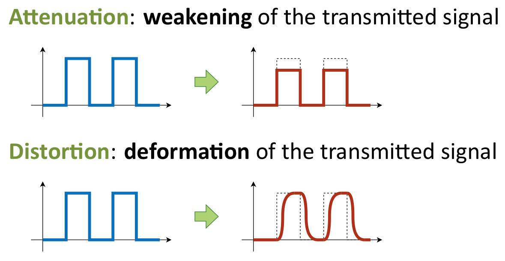

Neexistuje dokonalý přenos → signál přenášíme tak, aby šel zpětně rekonstruovat

### (B02) Analogové a digitální přenosy

Vždy se přenáší analogový signál, liší se pouze to, jak doručený signál interpretujeme.

#### Analogové

Zajímá nás přímo naměřená hodnota. Doručená hodnota bude vždy zkreslená.

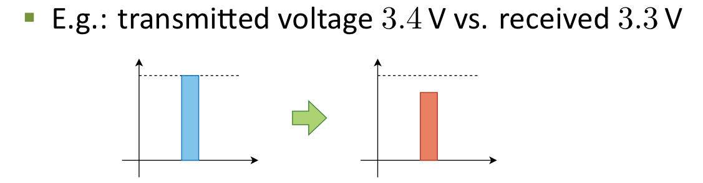

#### Digitální

Možné naměřené hodnoty jsou rozděleny do intervalů → podle intervalů určíme výsledek. Je optimální, daleko efektivnější. Vyžaduje menší šířku pásma. V každém uzlu je signál změřen a obnoven.

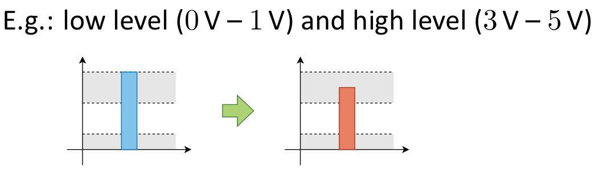

### (B03) Tvary a vlastnosti křivek

- Čtvercový, Trojúhelníkový, Sinusoida

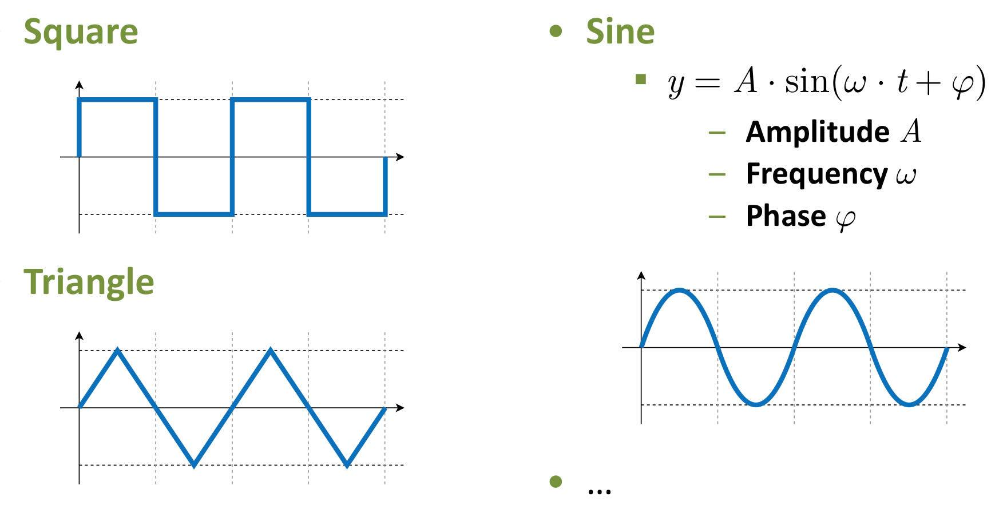
Libovolná křivka může být interpretovaná jako součet sinusoid (Fourierova transformace)

Přenosové cesty mají omezenou šířku pásma → spolehlivě lze přenášet pouze některé frekvence (charakterizuje to vanová křivka - prostřední se přenášejí dobře, krajní špatně)

Ostré změny jsou problematické - vyšší frekvence jsou oříznuty

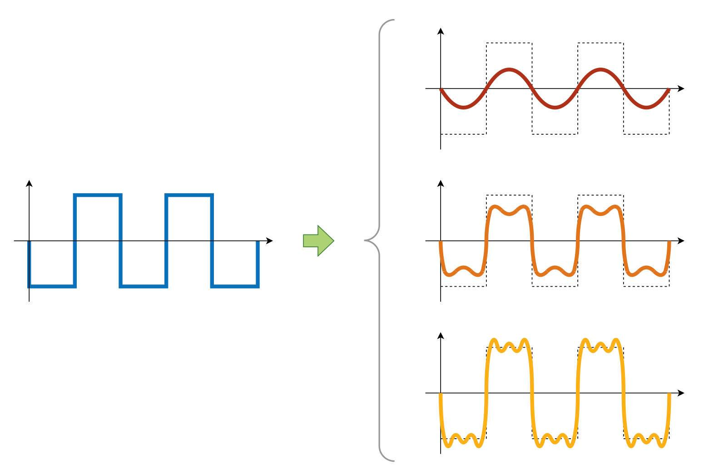

### (B04) Přenosy v základním pásmu (baseband)

- Nemodulovaný
- frekvence blízko nuly
- frekvence změny signálu = frekvence změny dat
- využívá čtvercový tvar křivky
- jeden datový signál zabírá celou šířku pásma (tzn. pokud využívám pro svůj přenos médium, nikdo jiný toto médium nemůže používat)
- pouze na krátké vzdálenosti
- typické pro wired media

typické vlastnosti (ukázáno na linkových kódech níže):

- polarita - kolik úrovní rozeznáváme
  - unipolární - rozeznáváme low/hig → dva intervaly
  - bipolární - negative/positive/zero → máme tři intervaly
- NRZ (non return to zero), RZ (return to zero) → po vyslání hodnoty se (ne)vrátím zpátky na nulu (Bipolar RZ/NRZ)
- bifázový - alespoň jeden přenos za bit
- kódování
  - buď měřím stabilní hladinu (unipolar/bipolar RZ/bipolar NRZ)
  - nebo směr změny signálu (manchester)

### (B05) Principy a příklady linkových kódů

informace reprezentována různými výškami signálu nebo hranami. Signál vysílán po určitou dobu

Cíle:

- zajistit dostatečně pravidelné změny v přenášených datech (důvody viz dále) → problém: vstupní data nemáme pod kontrolou

Příklady:

- unipolární (1V = -1, 0 V = -0 → po celý interval)
- bipolární RZ
  - 0 → polovina intervalu v -1V, pak polovina intervalu v 0V
  - 1 → polovinu intervalu v 1V, pak polovina intervalu v 0V
- bipolární NRZ (stejné jako uni, ale 1V = 1, -1V = 0)
- manchester
  - 0 → v polovině intervalu je klesající hrana
  - 1 → v polovině intervalu je rostoucí hrana

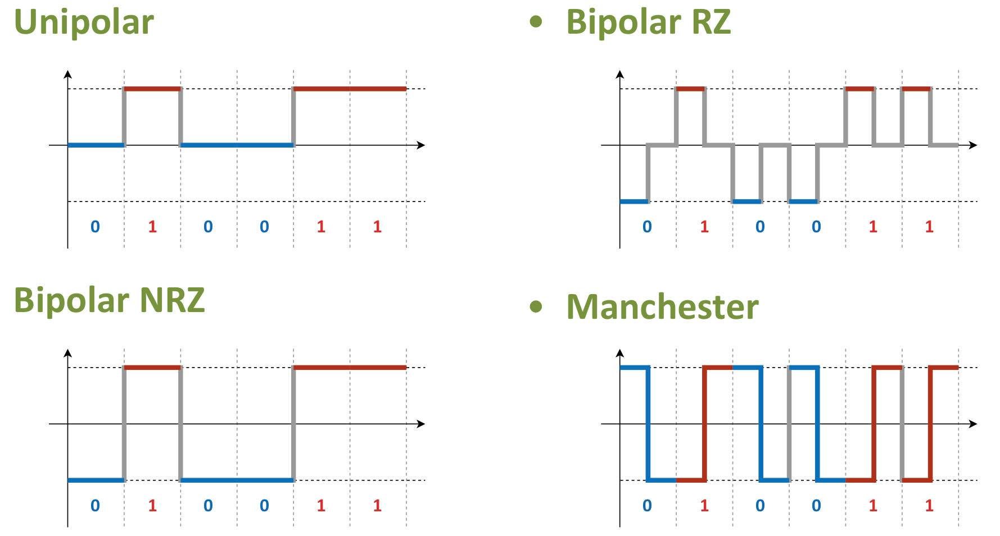

### (B06) Problém synchronizace, DC komponenty a disparity

#### Problém synchronizace

bitový interval (Bit period) = časový interval na poslaní jednoho bitu.

Potřeba synchronizovat čas odesílatele a příjemce, aby byly signály správně reprezentovány:

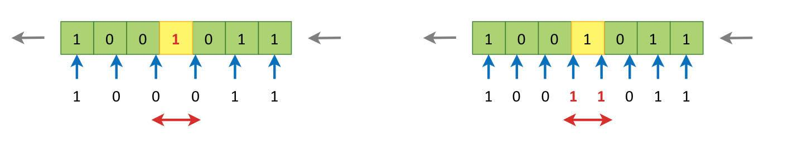

#### DC komponenta a disparita

problém mám médiu - podívám se na přenášené signály - když zprůmměruju amplitudu signálu (+1 -1) - je potřeba abychom se pohybovali okolo nuly - tomu se říká vybalanocvaná (nebo také že tam není žádna)

kdybych přenášel dlouho pozitivní/negativní --> tak je faktem, že to médium to fyzicky nezvládá

_DC → stejnosměrný proud_

DC komponenta = průměrná amplituda přenášené vlny

zejména na delší vzdálenosti chceme vybalancovanou (žádnou) DC amplitudu. Přístupy:

- konstantně vyvážený kód - každý symbol (tzn. to, jak zakóduju jeden symbol pomocí 1/0) je vybalancovaný sám o sobě, tzn uvnitř jednoho symbolu je +- stejný počet 1/0
- párovaný disparitní kód- balancování naskrz po sobě jdoucími symboly (hlídání disparity) --> průběžně počítám počet 1/0 a snažím se průběžně zajistit, aby jejich počet byl podobný

průběžná disparita = rozdíl počtu 0 a 1. Ideál je vyvážená disparita

### (B07) Techniky zajištění synchronizace

_clock recovery - proces extrahování času_

- oddělený hodinový signál - v praxi se nepoužívá
- self-clocking - hodinový signál je začleněn do dat (musíme přenášet dostatečné množství dat)
  - izochronní self-clocking - hodinový signál je poslán ve stejný čas jako data
    - direct recovery
      - přenášené signály mají v každém bitovém intervalu nějakou změnu - změna udává tiky hodin
      - techniky: redundant coding
    - indirect recovery
      - není zajistěn neustálý tikot, synchronizace chvíli vydrží, musíme se vyhnout dlouhým stejným sekvencím
      - techniky: bit stuffing, block coding
  - neizochornní self-clocking - hodinový signál je poslán v jiný čas než data, nepoužívá se

### (B08) Redundantní kódování, bit stuffing, scrambling

#### Rendundantní kódování

Každý bitový interval obsahuje (je to garantované) alespoň jednu změnu (0 → 1 nebo 1 → 0). Zajištěna synchronizace, ale 100% overhead.

Příklady:

- Manchester
  - směr změny uprostřed bitvého interalu určuje datový bit → hodinový signál je uprostřed bitového intervalu
  - dvojnásobný objem přenesých dat, 100% overhead (pro přenesení jednoho bitu potřebuju změnu --> tzn. potřebuju přenést dva bity mezi kterými je změna --> a to je ten jeden bit --> jinak řečeno jeden bitový interval ve kterém s epřenese jeden bit, obsahuje vždycky dva bity)
  - self-clocking, DC vyvážený, nevhodné pro velké objemy dat a velké vzdálenosti
  - využití (kdysi): ethernet (10 MB/s), NFC
- Bipolar RZ

#### Bitový stuffing

V případě dlouhé sekvence stejných symbolů vloží odesílatel opačný bit (příjemce bit odstraní). Zajištěna synchronizace, limitně 0% overhead (bit navíc dávám jenom výjimečně --> synchronizace se chvíli udrží --> je potřeba vkládat opačný symbol pouze v případě, že mám po sobě jdoucích N stejných symbolů (tzv. běh). takových dlouhých běhů ale není mnoho).

#### Scrambling

Bity první namícháme s pseudo-náhodnou sekvenci (příjemce musí být schopen vygenerovat stejnou sekvenci pro zpětnou rekonstrukci). Zlepšuje disparitu a synchronizaci. Samo o sobě to ale nic negarantuje.

### (B09) Blokové kódování

\*v dnešní době nejdůležitější

Před posláním vezme se skupina n bitů (blok) a přeloží se na základě daného (většinou pevně dané tabulkou, kterou spočítali chytří maatematici) mapování na $k>n$ bitů. Př. 0001 → 01001

Funkce:

- výsledná sekvence má hodně změn (0/1) - nejsou dlouhé běhy
- pro jednu vstupní máme více výstupních sekvencí, konkrétně 2 (nemůžu si vybrat libovolně --> jsem nucen použít tu, která aktuálně lépe vybalancuje disparitu)
- některé výstupní kódy jsou navíc - typicky třeba když by vzniklo `00000` nebo `11111` (aby nebyly úplně zbytečné, tak se používají jako řídící signály nebo detekce chyb)

Příklady:

- 4B5B
  - 4b → 5b
  - self clocking, DC balanced jenom se scramble, disparita nevyvážená
  - 25% overhead (na každou čtveřici bitů přidáme jeden bit navíc)
  - použití: fast ethernet
- 8b/10b
  - 5+3b → 6+4b (osmici rozdělím na dvě části 5b+3b, tudíž mapování probíhá dvakrát)
  - garantuje synchronizaci, self clocking, DC vyvážený, omezená disparita
    - běh nejvýše 5 stejnýh bitů za sebou
    - maximální disparita $\pm$ 2
  - 25% overhead
  - použití: Gigabit Ethernet (1GB/s), HDMI, SATA, USB 3.0

### (B10) Přenosy v přeloženém pásmu (passband)

[článek](https://resources.system-analysis.cadence.com/blog/msa2021-types-of-digital-modulation)

modulované přenosy - Přenášíme sinusovku (tzv. nosnou harmonickou vlnu) → samotná vlna nenese informaci, informace je reprezentovaná **změnami** ve vlnovém parametru (3 parametry = 3 možnosti co měnit)(nese změny, proto nosná --> carrier)

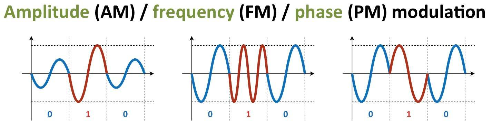

mohu změnu parametrů kombinovat (ne všechno lze ale kombinovat --> třeba změna amplitudy je náročná realizovat na velké vzdálenosti --> prostřední je frekvence --> nejlepší je změna fáze, to je nezpochybnitelné vždy a nejsnadněji detekovatelná)

dva typy modulace - analogová a digitální. Jediný rozdíl je v tom, že u digitální modulace rozeznáváme omezené (diskrétní) množství stavů (česky - buď reprezentujeme danou změnu jako 0 nebo jako 1). Př. (vztaženo k obrázku nahoře):

- amplituda
  - 1 → vyšší amplituda
  - 0 → nižší amplituda
- frekvence
  - 1 → vyšší ferkvence
  - 0 → nižší frekvence
- phase
  - 1 → vyšší
  - 0 → nižší

klíčování = digitální modulace (v češtině se ale tento termín nepoužívá). Techniky:

- Amplitude-shift keying (ASK) - odlišné amplitudy
- Frequency-shift keying (FSK) - odlišné frekvence
- Phase-shit keying (PSK) - odlišné phases

Pozorování:

- menší zkreslení → přenos na větší vzdálenost → vyšší využití (bezdrátová média a optika)
- vyšší frekvence
- typické pro bezdrátové připojení a optické kabely

### (B11) Kvadraturní amplitudová modulace (QAM)

informace reprezentována změnami v parametrech vlny (analogová a digitální modulace)
používá se např. u wifi

alternativy:

- 16-QAM (16 stavů → 4b symboly → tzn. odesláním jednoho symbolu odešlu 4 bity)
- 64-QAM (64 stavů → 6b symboly)
- 256-QAM (256 stavů → 8b symboly)
- 1024-QAM (1024 stavů → 10b symboly)

#### 16-QAM

- vysíláme dvě vlny posunuté o $\frac{\pi}{2}$
- u první vlny amplitudová modulace (3 možné stavy → na obrázku níže reprezentované jako kružnice)
- u druhé fázová modulace (12 možných stavů → na obrázku níže reprezentované jako úsečky)
- celkem 36 možných stavů → používáme pouze 16 z nich (ty, které lze od sebe snadno rozlišit)
- namapujeme stavy na hodnoty (Greyovy kódy) - dva sousední stavy se liší právě v jednom bitu (v případě, že dojde k chybě při interpretaci stavů, tak bude chyba pouze v jednom bitu)

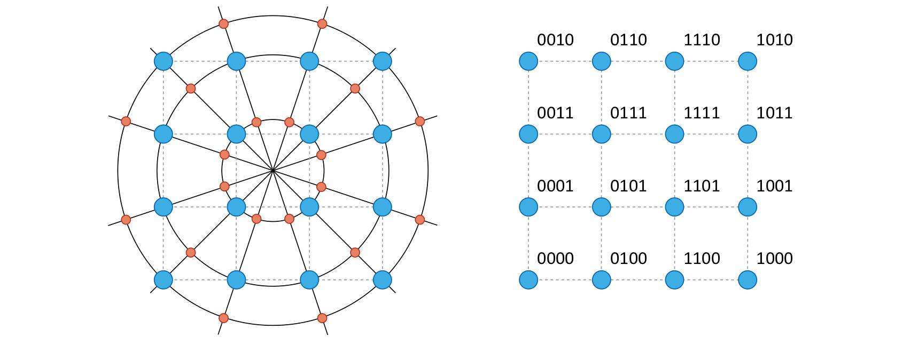

### (B12) Zajištění transparence

Aby linková vrstva fungovala, musí uěmt přenášet jak užitečná data tak kontrolní singály a rozeznávat je od sebe

- Užitečná (data pro vyšší vrstvy) - nelze je modifikovat, respektive můžeme, ale příjemce je musí umět zpětně zrekonstruovat
- Řídící signály - je třeba umět je detekovat a interpretovat.

Transparence = rozlišování užitečných dat od signálů

Strategie pro proudové přenosy (v telekomunikačních sítích):

- oddělená přenosová cesta - zvlášť cesta pro data a zvlášť pro signály - pravěk
- escaping (přepínání interpretací) - dva módy data/signály, teď se přenáší data → přepne se mód → teď se přenáší data. Je potřeba mít přepínací mechanismus mezi módy

Strategie pro blokové přenosy:

- framing

### (B13) Techniky framingu a zapouzdření

Jak zajistit přenos a transparenci blokových dat.

Encapsulation (zapouzdření) - vytvoření rámce (obecně PDU) --> vezmu data a pomocí definovaného formátu přidám metadata (hlavička, tělo, patička..)

Framing - již mám vytvořený rámec → nyní přichází framing → vymezení hranic rámce v datech. L1 přenáší pouze stream bitů → příjemce musí být schopen identifikovat začátek/konec rámce v nestrukturované sekvencim kterou nám přidala L1

Obecné techniky (nezávislé na L1):

níže popsané metody využívavjí techniku stuffingu (vložíme navíc nějaké informace/bity/flagy)

- Flag (byte, sekvence bitů) na začátku a na konci rámce → potřeba vyřešit, aby se nevyskytl někde uprostřed
- Start flag + délka - označíme flagem začátek rámce, konec rámce je spočítán pomocí délky (ta je uložena většinou v hlavičce). Není moc používané kvůli tomu, že je obtížné zpětné obnovení v případě desynchronizace

Specifické techniky (závislé na L1):

- starting flag + implicitní konec - Začátek rámce je označen flagem, konec rámce odpovídá konci přenosu (mám garantovné, že nemůžu lepit rámce přímo za sebe, tudíž mám garantovanou pauzu v přenosu).
- Coding violation - speciální nedatové symboly označují start/konec bloků. Př. 4B5B
- Počítání bloků -
  určím si časový interval (5 sekund --> blbost ale pro ilustraci) --> za tento interval pošlu X bloků, nevím kolik --> první blok, který pošlu je inicializační (natolik specifická sekvence, že ho bezpečně poznám) --> ten mi řekne, jak je dlouho se posílá jeden blok --> poté vydělím interval délkou pro tento blok a zjistím na jakém místě je jaky blok (dá mi to intervaly pro jednotlivé bloky --> slot)
  délka bloků spočítaná na základě dělení času (funguje pouze pro bloky s fixní délkou).

### (B14) Techniky stuffingu

Záměrné přidávání speciálních znaků/bitů/bytů k označení konkrétního místa v přenášených datech

Využití (na L2):

- transparence (escaping, framing)
- řešení výskytů flag-sekvencí v užitečných datech → potlačení meta významu flag-sekvencí uvnitř užitečných dat
  - tady vlastně řeším problémy stuffingu stuffingem
- kooperace mezi fyzickou a linkovou vrstvou

### (B15) Znakově orientované protokoly

Kontrolní příkazy jsou vyjádřeny pomocí speciálních netisknutelných ASCII znaků. Dnes se již nepoužívá.

struktura rámce:

- hlavička (je nepovinná) a tělo:
  - SOH (start of header) - začátek hlavičky
  - STX (start of text) - začátek dat
  - ETX (end of text) - koenc dat
- kladný escaping (DLE) je potřeba pro aktivaci meta významu → tzn. když datech narazím na samotný SOH/STX/ETX tak mi to nevadí, protože, před nimi nebude DLE.  
  problém by byl, kdyby byl v užitečných datech DLE + něco → v takovém případě zdvojíme DLE → poznáme, že to nemá mít žádný speciální význam, ale že jsou to data

Pro lepší synchronizaci s L1 přidáváme na začátek rámce dva synchronizační charaktery SYN

Příklad: SLIP

- z obrázku vidíme, že chybí hlavička (ždáná adresa, prostě nic), pouze užitečná data → je to proto, že protokol je určen pouze pro P2P a fully duplex spojení → umožňuje přímé zapozdření IP paketů bez hlavičky. Potřeba pouze framing, nic víc
- začátek a konec rámce je označen pomocí END flagu
- END uprostřed

### (B16) Bitově orientované protokoly

Na začátek a konec rámce dáme flag → flag má strukturu $N$ jedniček a po krajích nuly (př. 0111111110). Potřeba zajistit, aby se flag nevyskytl uprostřed → když odešleme $N-1$ jedniček, tak uměle vložíme (pošleme) nulu. Příjemce tuto nulu odstraní.

Příklad: HDLC

- spojovaný i nespojovaný protokol pro P2P a P2MP cesty

Princip rámcování:

- Flag s $N=6$
- bit stuffing pro zajištění transparentnosti bloků

### (B17) Bytově orientované protokoly

Označujeme začátek nebo konec flagy jako u bitově orientovaných protokolů, pouze je potřeba zarovnání na celé byty (tzn. flag má velikost celých bytů - 1,2...). Také se používají escapovací byty jako ve znakově orientovaných protokolech, které využijeme k označení vnitřních flagů. Také mohou být použity synchronizační flagy.

Příklad: Ethernet

princip rámcování:

- synchronizační preambule - sekvence 7B `0x55` přenesných jako `10101010` (LE pořadí pro bity), neslouží k framingu, opravdu slouží pouze pro synchronizaci
- začátek rámce - SFD: `0xD5` přenesených jako `10101011`

## Síťová vrstva a směrování

Zpět na [Přehled](#přehled).

úkolem síťové vrstvy je dostat pakety přes **systémy sítí**, které jsou propojené routery.

### (B18) Routing a forwarding

- Routing - Proces hledání optimální cesty
- Forwarding - Proces samotného posílání paketů

### (B19) Směrovací a forwardovací tabulky

Routovací tabulky:

- Cíl - IP adresa cílové sítě (př. 192.168.2.0)
- Interface - IP adresa síťové karty, která má být použita pro předání IP datagramu
- Gateway - IP adresa sousedního routeru (př. 192.168.1.1)
- Metrika - vzdálenost (_cena_) při použití dané trasy do cíle (př. 11)

Forwardowací tabulky

- Předpočítané tras

### (B20) Obvyklé přístupy směrování

- Destination-based - založeno na cílové adrese (ne na zdrojové)
- Least-cost - výběr cesty podle nejmenší ceny
- Hop-by-hop - každý router se rozhoduje nezávsilé na jiných
- Content-independent - neberou se v potaz posílaná data
- Stateless - neberou se v potaz výsledky minulých posílání

### (B21) Klasifikace směrovacích přístupů

- Adaptivní/neadaptivní - Jestli se berou v potaz změny v síti
- Centralizované/distribuované - Jestli routery dělají rozhodnutí v závislosti na jiných routerech
- Izolované/neizolované - Jestli se očekává spolupráce routerů
- Interior/exterior - jaký je rozsah nasazení v rámci hierarchického směrování → uzly "uprostřed" (interior) grafu s mnoha propojeními budou muset zpracovat více dat, než uzly na okraji (exterior), které nejsou tak vytížené

### (B22) Adaptivní a neadaptivní směrování

#### Adaptivní (dynamické)

Berou se v potaz změny v síti (vytíženost cest, routerů, změny v topologii). Routovací tabulky se neustále přepočítávají

cíl: routing convergence - všechny routery mají stejné informace o topologii

#### Neadaptivní (statické)

Neberou se v potaz změny v síti → tudíž nepotřebují komunikvoat s ostatními uzly. Routovací tabulky se nemění.

př. Fixed directory routing, Random walk, flooding

### (B23) Statické (fixní) směrování (Fixed directory routing)

Routovací tabulky jsou nastaveny manuálně administrátorem
výhody:

- známe dopředu cestu (neaktualizujeme)
- vyšší bezpečnost (aktualizované informace mohou být padělané)

Nevýhody:

- nepřístupné změnám
- pomalé ve velkých sítích
- administrátor může udělat chybu

Lze kombinovat s adaptivním přístupem → nastavení defaultních routerů nebo použití v případě, že dynamické routování je aktuálně nedostupné

### (B24) Záplavové směrování

Příchozí pakety jsou duplikovány a rozeslány všemi dostupnými směry (krom toho, odkud paket přijel)

výhody:

- nejsou potřeba informace o síti (tedy žádné routovací tabulky)
- jednoduché na implementaci
- pakety vždy dorazí do cíle, pokud existuje cesta (použití při posílání důležitých zpráv, či vojenských oznámeních)

Nevýhody:

- přílišné zatížení sítě - v případě existence ($\geq2$) cyklů může dojít až k exponenciální duplikaci paketů ve stejném uzlu.

### (B25) Techniky řízené záplavy

Technika, jak vyřešit problém caklů (paket přijde dvakrát do jednoho uzlu)

#### Hop count

Paket dostane na startu číslo. V každém routeru se sníží o jedna. Když je na nule, paket se zničí. (číslo musí být dost velké, aby paket mohl dorazit do cíle).

#### Sequence numbers

pakety dostanou pořadové číslo. V každém uzlu si pamatuji seznam dvojic _adresa odesílatele + pořadové číslo_. Přijde-li "stejná dvojice", je paket ignorován.

problémy:

- omezená paměť uzlu
- v případě navázaní nového spojení mohou být nově posílané pakety považovány za staré

#### Reverse path forwarding

V uzlu si pamatuju směr, odkud očekávám, že přijde daný paket, když přijde tento paket jinou cestou, zruším ho.

#### Spanning tree

Nejdříve se vytvoří kostra grafu (sítě), pakety jsou posílány pouze po cestách, které jsou součástí kostry.

### (B26) Centralizované směrování

Routovací rozhodnutí dělá primárně _rout server_ → když je potřeba routovací informace, pošle se request do rout serveru. Ostatní uzly dělají pouze forwarding.

výhody:

- velká flexibilita

nevýhody:

- selže rout server → selže vše

### (B27) Distribuované izolované směrování

Každý router dělá routovací rozhodnutí sám, ale uzly nespolupracují

př. Metoda zpětného učení, metoda zdrojového směrování, horká brambora (hot potato)

### (B28) Metoda zpětného učení

Na začátku mám prázdnou tabulku. Přijde-li paket od neznámého odesílatele, zapamatuje se směr odesílatele. Paket je odeslán buď:

1. do všech směrů když neznáme směr příjemce
2. ve směru příjemce

Abychom udržovali aktuální informace, tak kombinujeme s [hop counterem](#hop-count). Paket obsahuje číslo (to s každým hopem zvyšujeme), jestliže je nová cesta kratší, aktualizujeme ji v seznamu.

### (B29) Metoda zdrojového směrování

Odesílatel najde kompletní cestu k příjemci, po které se pošlou data.

Hledání: pošle se speciální paket [záplavovou metodou](#b24-záplavové-směrování) → po cestě se tvoří seznam IP adres, kudy jel → když dorazí do cíle, je do startu odeslán seznam, kudy posílat pakety → seznam se vloží do každého odeslaného paketu.

výhody:

- vždy se najde nejkratší cesta

Nevýhody:

- nevýhody záplovavého směrování

### (B30) Distribuované neizolované směrování

Každý router dělá routovací rozhodnutí sám, ale uzly spolupracují

př. Distance-vector směrování, link-state směrování, path-vector

### (B31) Směrování distance-vector

Každý uzel má vlastní routovací tabulku s nejkratší spočítanou cestou do objevených sítí. Aplikace Bellman-Fordova algoritmu.

distance-vector = routovací tabulka s těmito záznamy:

- cíl - adresa cílové sítě
- směr -
- gateway - sousední router
- metrika - celková cena pro dosažení cílové sítě

Sousední uzly si cca. co 30s předávají aktuální informace

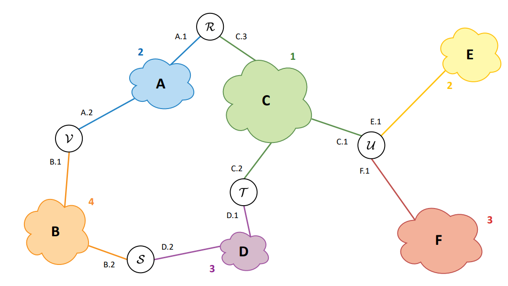

na začátku inicializujeme tabulku pro každý router. Při inicializaci jsou v tabulce obsaženy pouze přímo sousedící sítě, do kterých se z routeru lze dostat.

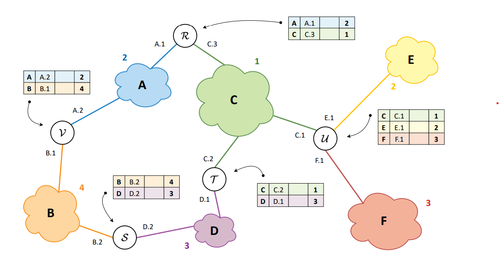

Poté postupně předávám informace mezi sousedními routery → přidávájí se nové záznamy, aktualizují se ty staré. Můžeme např. zpropagovat informace z $R$ do sousedních vrcholů ($V$, $T$, $U$). Do $V$ přidáme informaci, že do sítě $C$ se lze dostat přes vrchol $R$ (vzdálenost je 3, protože $V→R = 2$ a $R→C=1$). Analogicky doplníme do $C$, jak se dostat do $A$, a do tabulky vrcholu $T$ doplníme info jak se dostat do vrcholu $A$:

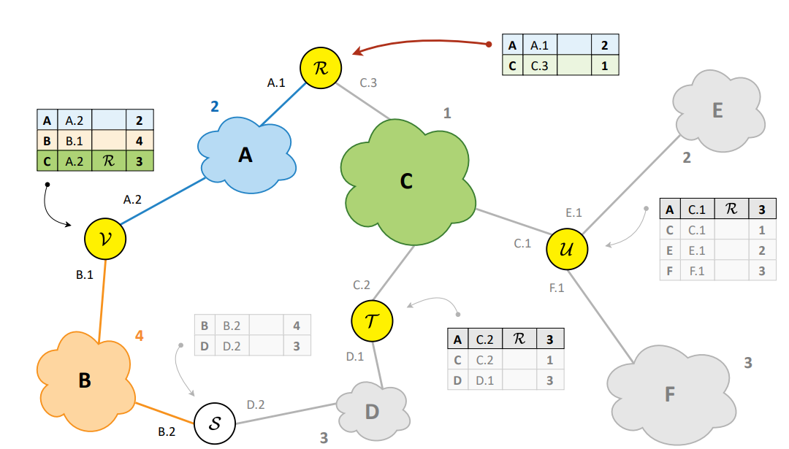

Stejně bychom mohli rozšířit informace z vrcholu $S$ do vrcholů $T$ a $V$

Pravidla pro aktualizaci záznamů v tabulce:

1. Pokud mohu doplnit novou cílovou síť, která zatím není v tabulce, doplním ji
2. Pokud je síť v tabulce, a je dosažitelná přes stejný uzel, je záznam ponechán a pouze se přepočítá nová vzdálenost
3. Pokud je síť v tabulce dosažitelná skrz nový uzel, přepočítá se, jestli je cesta přes nový uzel kratší, když ano, je starý záznam celý smazán a nahrazen novým záznamem

Kompletní tabulky by vypadaly takto:

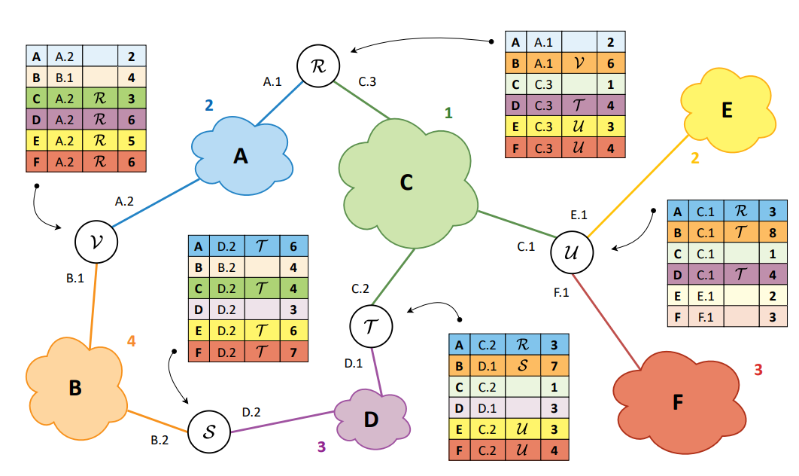

### (B32) Problém count to infinity

Jedná se o problém, který vznikne při Distance-vector routingu. Mějme tři uzly, kterým jsme spočítali routovací tabulky podle distance-vector routingu:

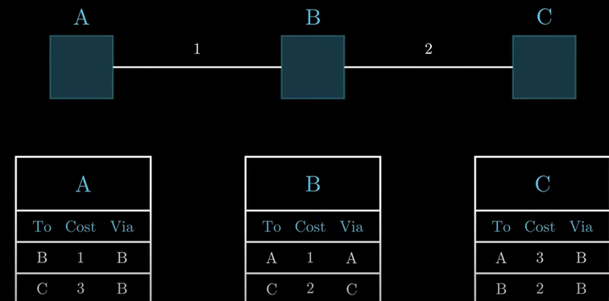

Najednou se ale stane, že zmizí spojení mezi B a C. Aktualizujeme tedy tabulky:

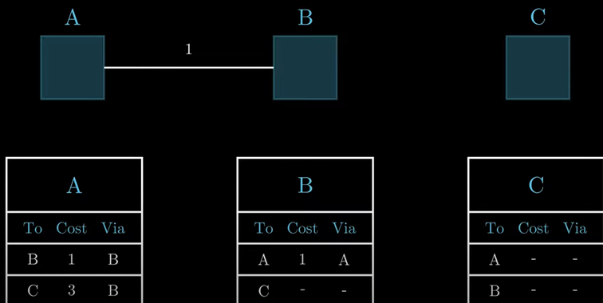

Nyní ale kombinací tabulek A a B dostaneme, že: z B se lze dostat do A a z A se lze dostat do C. Celkem to zabere délku 3. Proto aktualizujeme záznam v B.

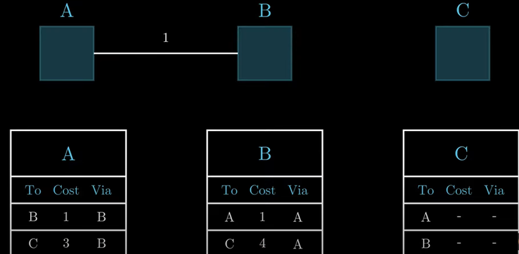

Nyní je ale potřeba aktualizovat záznam v tabulce A. A totiž jde do C přes B. Jenmožne z A do B je to 1. Pak se ale v B dočteme, že do C je to 4, tedy 1+4=5 → z A do C je to 5.

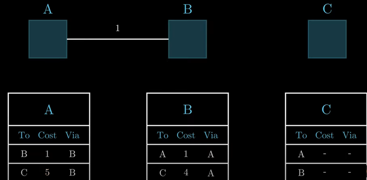

Takto by to pokračovalo až do nekonečna.

Řešení:

1. Malé nekončeno - nastavíme maximální hodnotu pro vzdálenost. Musí být dostatečně velká, aby byly všechny vrcholy dosažitelné.
2. Split horizon - jestliže uzel A získal informace z uzlu B, pak uzel A nebude předávat nové informace uzlu B.
3. Poisoned reverse - jestliže je cesta zrušena, je vzdálenost nastavena na nekonečno.

### (B33) Vlastnosti protokolu RIP

- vzdálenost se počítá podle počtu skoků (nekonečno je 16)
- routovací tabulky mají max 25 záznamů
- aktualizace se dělá každých 30s
- nepoužitelný ve větších sítích

### (B34) Směrování link-state

Každý uzel má informace o celé síti, tedy každý uzel může dělat výpočty sám za sebe. Neustále se kontroluje dostupnost sousedních vrcholů, v případě nedosažitelnsoti je informace předána všem uzlům.

Př. OSPF (Open Shrotest Path First)

### (B35) Srovnání principů RIP a OSPF

### (B36) Velikost tabulek a aktualizací

### (B37) Směrovací domény

### (B38) Techniky směrování na L2

## Transportní vrstva a protokoly

Zpět na [Přehled](#přehled).

### (B39) End-to-end komunikace

TODO

komunikace mezi odesílatelem a příjemcem

vrstvy L1-L3 pracují na atomické úrovni

L4 a vyšší vrstvy jsou implementovány pouze v koncových uzlech (ne v routerech).

_Multiplexing_ - z pohledu odesílatele → spojení několika nezávislých přenosů do jednoho (na L3 máme pouze jednu přenosovou cestu)
_Demultiplexing_ - z pohledu příjemce → rozdělení přijatých datagramů

### (B40) Transportní spojení

Aplikace (odesílatel) komunkuje s několik příjemci, je třeba je rozlišit:

- identifikátor spojení je pětice (IP1, port1, protocol, IP2, port2)
- indentifikátor odesílatele (IP2, port2, protocol)
- identifikátor přijemce (IP2, port2, protocol)

### (B41) Srovnání protokolů TCP a UDP

| TCP                                | UDP                                |
| ---------------------------------- | ---------------------------------- |
| komplexní                          | primitivní                         |
| byte stream, spojovaný, spolehlivý | blokový, nespojovaný, nespolehlivý |
| ochrana proti přetížení sítě       | žádná ochrana proti přetížení sítě |
| flow control                       | chybí flow control                 |

_Flow control_ - Obrana před tím, aby rychlejší odesílatelé přehltili pomalejší příjemce

### (B42) Bytový stream TCP

Aplikace generuje proud bytů → ukládají se do bufferu → je-li buffer zaplněn (nebo je obdržen request), vytvoří se TCP segmenty, které se odešlou

Segmenty jsou očíslovány (kvůli zpětnému sestavení)

### (B43) Navazování spojení

(spojované přenosy).

Navázání spojení:
3-way handshake: uzel A odešle žádost o spojení → uzel B pošle zpět potvrzení → uzel A odešle závěrečné potvrzení → až teď je spojení navázáno.

### (B44) Zajištění spolehlivosti

Cheme zajistit, aby data dorazila nezměněná.

| Spolehlivý přenos       | Nespolehlivý přenos         |
| ----------------------- | --------------------------- |
| kontroluje a řeší chyby | nekontroluje a neřeší chyby |
| většinou vhodné         | vhodné v multimédiích       |

Problémy:

- Ztráta bloků - celý blok není doručen. Děje se hlavně na L3 (špatně spočítaná routing path, vypršel time to live, přetížení sítě...)
- Poškození bloků - jsou změněny bity v bloku. Poškození se děje hlavně na L1 (rušení, útlum...)

### (B45) Detekce poškozených bloků

#### Ztráta

Detekce: číslování (blokům přířadím pořadové číslo, či označím pozice v proudu dat)

Obnova: příjemce pošle request odesílateli o znovuposlání

#### Poškození

Princip detekce: odesílatel spočítá z dat v odesílaném bloku kontrolní hodnotu a přiloží ji k bloku. Příjemce z doručených dat spočítá kontrolní hodnotu, když hodnota sedí s přiloženou hodnotu, blok (pravděpodobně) nebyl poškozen.

Mechanismy pro výpočet: Kontrola parity, kontrolní součty, CRC (Cyklické redundantní součty)

Lze provést samoopravu (Hammingovy kody, vícedimenzionální kontrola parity), moc se ale nepoužívá (neefektivní). Využívá se spíše znovuposílání bloků (je nám jedno, co za chybu nastalo, kde se v bloku vyskytla apod., protože stejně pošleme celý blok znovu)

### (B46) Kontrola parity

Za skupinu bitů přidáme 1 bit:

- Lichá parita
  - celkový počet 1 (včetně přidaného bitu) ve skupině bitů je lichý
  - posílám-li skupinu 1000 → přidám 0 → pošlu 10000
  - posílám-li skupinu 1100 → přidám 1 → pošlu 11001
- Sudá parita
  - celkový počet 1 (včetně přidaného bitu) ve skupině bitů je sudý
  - posílám-li skupinu 1000 → přidám 1 → pošlu 10001
  - posílám-li skupinu 1100 → přidám 0 → pošlu 11000

Podle veliksoti skupiny rozlišujeme:

- transverse parity - skupina je byte (slovo)
- longitudinal parity - zvolím nějaký počet bitů (N), za každých N bitů umístíme kontrolní paritu

### (B47) Kontrolní součty

Provede se součet jednotlivých bytů (slov) → výsledek je použít jako kontrolní hodnota. Příjemce rovněž provede součet → výsledky musí bát stejné.

Občas se používá se dvojkový doplněk:

1. Odesílatel provede součet bytu (slova)
2. součet přiloží k bytu a pošle
3. Příjemce provede součet → udělá z výsledku dvojkový doplněk, sečte s přiloženým součtem, výsledek musí dát nulu

_Přišel (spolu s bytem) součet 1011 → když bych dělal jedničkový doplněk tak by to vypadalo takto: ~1011+1011=1111 (součet čísla s jeho negací jsou samé jedničky). Když ale dělám dvojkový doplněk tak přičtu ještě jedničku, tudíž se zvětší počet bitů o jedna a dostanu 10000 (jedničku a samé nuly). Jednička se uřízne (je mimo rozsah), tudíž vyjdou samé nuly. Závěr: když je kontrolní součet stejný, tak součet s dvojkovým doplňkem je 0._

Lepší než kontroloní parita, stále tento způsob ale není dostatečně efektivní.

### (B48) Cyklické redundantní součty

Princip:

Chceme spočítat kontrolní hodnotu. Ta je určena vstupním textem (to co chci poslat př. 01101001) a klíčem (je určen podle toho, jakou CRC metodu používám, př. 00110101).
Klíč a text převedu na polynomy (koeficient odpovídá hodnotě bitu):

- $01101001 \rightarrow x^6+x^5+x^3+x^0 $
- $00110101 \rightarrow x^5+x^4+x^2+1 $

Vydělím text klíčem, dostanu nový polynom (veškeré operace jsou $\bmod 2 $). Z koeficientů nového polynomu poskládám binární číslo a toto binární číslo je kontrolní hodnota. Pošlu text + kontrolní hodnotu. Příjemce pak provede CRC a musí mu vyjít nula (protože jsme přičetli zbytek).

Používá se značení CRC-X (př. CRC-8, CRC-32), kde X označuje stupeň polynomu klíče (př. pro CRC-32 může být klíč $x^{32}+x^{25}+x^4$).

Hardwarová implementace je velice snadná, používá se XOR/ AND gateways a shift registry. Navíc je CRC velice spolehlivé (CRC-32 odhalí chybu na 99.99999998%). CRC odhalí pouze chyby způsobené hardwarem, pro odhalení chyb hacknutím je to slabé.

### (B49) Potvrzovací strategie

Pokažené/ztracené bloky se dají obnovit znovuposláním. Abychom věděli, kdy znovuposlat, potřebujeme potvrzovací strategii (Automatic Repeat Request (ARQ)).

ARQ je skupina strategií pro znovuposílání založená na pozitivních/negativních ACK (acknowledgments) a časových intervalech.

### (B50) Jednotlivé potvrzování

Odesílatel:

- pošle **jeden** blok, čeká na ACK
- obdrží ACK → když je negatviní, pošle blok znovu, když je pozitivní, pošle další
- nedorazí-li žádný ACK v časovém intervalu, je blok poslán znovu

Příjemce:

- obdrží blok → spočítá kontrolní hodnotu → sedí-li pošle pozitivní ACK, nesedí-li, pošle negativní ACK
- obdrží-li opravený blok (tzn. znovuposlaný), opět ho musí potvrdit

Použitelné pouze v lokálních sítích, ne ve velkých (velký delay)

### (B51) Kontinuální potvrzování

Byty jsou posílány kontinuálně, nečekáme na ACK.

Jak naložit s pokaženými bloky? V momentě, kdy objevím pokažený blok, mohlo přijít několik dalších. Dvě strategie: Potvrzování s návratem a Selektivní opakování

### (B52) Potvrzování s návratem

Celý přenos začne znovu od místa, kde došlo k selhání. Bloky, které následovaly po vadném bloku jsou rovněž smazány (i když byly doručeny v pořádku). Snadné na implementaci, ale plýtváme.

### (B53) Selektivní opakování

Pouze poškozený blok je poslán znovu. Neplýtváme, ale náročné na implementaci (úspěšně poslané bloky po tom vadném musí být uloženy v bufferu a nemohou být dále zpracovány, musí čekat na znovuposlání vadného).

### (B54) Metoda posuvného okénka

### (B55) Problém řízení toku

Ujištění, že pomalí příjemci nebudou zahlcení rychlými odesílateli. Řešení: odesílatel bere v potaz kapacitní možnosti příjemce.

TODO posuvné okénko

### (B56) Předcházení zahlcení sítě

Chceme předejít tomu, aby odesílatelé přetížili celou síť (tzn. uvažujeme omezenou kapacitu cest a výpočetní kapacitu uzlů).

Feedback techniky:

- Snažíme se reagovat na různé příznaky přetížení
- TCP na L4 - používá metodu posuvného okénka (není-li doručen ACK, považuje se to za známku přetížení). Slow start = Odesílatel začne s šířkou okénka 1 a postupně šířku zvětšuje

Forward techniky:

- aktivně ovlivňujem, co posíláme do sítě
- _Traffic shaping_ - excessive traffic is delayed
- _Traffic policing_ - excessive traffic is discarded

### (B57) Spolehlivost v TCP

### (B58) Možnosti zajištění QoS

### (B59) Principy řešení DiffServ

### (B60) Principy řešení IntServ

### (B61) Opatření client buffering

## Internetworking

Zpět na [Přehled](#přehled).

Dva významy internetworkingu:

1. Mám několik sítí (soustav) a řeším, jak je propojit
2. Mám jednu síť (soustavu) a řeším, jak ji rozdělit na menší části a jak tyto části následně zase propojit

### (C01) Cíle internetworkingu

obecný cíl: Propojit skupiny uzlů pomocí aktivních a pasivních prvků tak, aby byla umožněna jejich vzájemná komunikace.

Konkrétní problémy:

- Řešení omezení přenosových médií
- Optimalizace datových toků a vyvažování zátěže
- přístupová (a další) práva
- bezpečnost a ochrana před útoky
- snaha o větší využívání sítě dalšími uživateli

### (C02) Aktivní a pasivní síťové prvky

to, co potřebujeme propojit, propojíme pomocí vhodné „krabičky“, vše je pak o tom, jak „krabička“ funguje

#### Pasivní

nijak (aktivně) nepracují s tím, co přenáší

- Kabely, konektory rozbočovače, zásuvky
- propojovací pole (tzv. patch panely), skříně (rack-y), obecně to,co pomáhá strukturovat kabeláž

#### Aktivní

Zařízení ("v zásuvce"), která se aktivně podílejí na posílání dat

- L1 - repeater (opakovač) - zesiluje a tvaruje signál
- L2 - bridge a switch - Filtrování a přeposílání rámců v rámci lokální sítě
- L3 - router - routing a forwarding paketů mezi sítěmi
- L7 - gateway (brána) - pokročilé funkcionality jako firewall, NAT apod.

### (C03) Propojování napříč vrstvami

- L1 - propojení jednotlivých (skupin) uzlů → výsledkem je _segment_
- L2 - propojení jednotlivých segmentů → výsledek je _síť_
- L3 - propojení jednotlivých sítí → výsledek _internetwork_

### (C04) Principy propojování na L1

propojovací zařízení pracuje s jednotlivé bity, nerozumí jejich významu

### (C05) Funkce opakovačů

zesiluje a znovu tvaruje přenášený signál (kompenzuje zkreslení, útlum a další vlivy okolí) → obnovený signál okamžitě přepošle dál (nejsou zde žádné buffery)

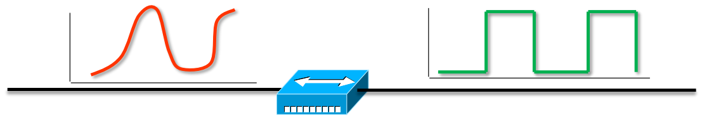

### (C06) Vlastnosti opakovačů

opakovač je průchozí (neukládá data do bufferu) → co přijde, hned odejde

data prochází opakovačem z **konstantním** miniaturním zpožděním → opakovače mohou propojovat pouze segmenty se stejnou přenosovou rychlostí (nedokázaly by vyrovnávat rozdíly v rychlostech)

opakovač nerozumí datům (bitům) → ke všem bitům se chová stejně (tzn.vše, co přijde, předá do všech odchozích směrů → na L1 totiž nemáme ani adresy). Propouští i kolize (viz dále)

opakovače jsou závislé na technologii, použité na L2 (konkrétní technologie na L2 používají různé kódování, které opakovače musí respektovat, používají různou přenosovou rychlost atd.) → neexistuje obecně použitelný opakovač

Co je propojeno pomocí opakovačů se chová jako jeden souvislý kabelový segment

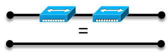

### (C07) Přístupová metoda CSMA/CD

= Carrier Sense Multiple Access with Collision Detection

Chceme-li začít přenášet, musíme se ujistit, že nikdo jiný (CS) nepřenáší přes sdílené médium (MA)(viz dále). Pokud přenáší, tak počkáme. V průběhu přenosu kontrolujeme případné kolize (CD). I přes CS krok, může jiný uzel začít přenášet. V takovém případě přerušíme přenos a začneme přenášet speciální **jam signal**.

To, co je (v Ethernetu) propojeno pomocí opakovačů, tvoří _kolizní doménu_ (kolizní doména = segment). Aby se kolize v rámci kolizní domény stihla rozšířit, je délka segmentu omezena. Př v 10 Mb/s Ethernetu:

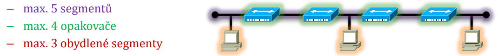

Tato technologie se již dnes nepoužívá

### (C08) Přenosová kapacita segmentu

to co je propojeno pomocí opakovače se chová jako jeden segment. Sdílení

pokud A posílá rámec B, tento rámec je šířen přes opakovač do dalších segmentů, kde obsazuje zdejší přenosovou kapacitu (tzn. např. D nemůže přenášet rámec k C)

Řešení pomocí filtrování a cíleného forwardingu

### (C09) Principy propojování na L2

Na L1 vrstvě jsme spojováním dostali segmenty. Nyní na L2 dostaneme propojením segmentů sítě. Propojení se realizuje pomocí mostů a switchů.

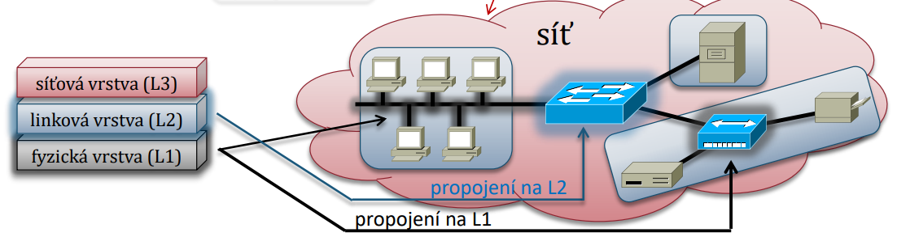

Hlavním cílem je filtrování a cílený forwarding

### (C10) Filtrování a cílený forwarding

#### Filtrování

data, která začínají i končí v jednom segmentu nejsou šířená dál do dalších segmentů.

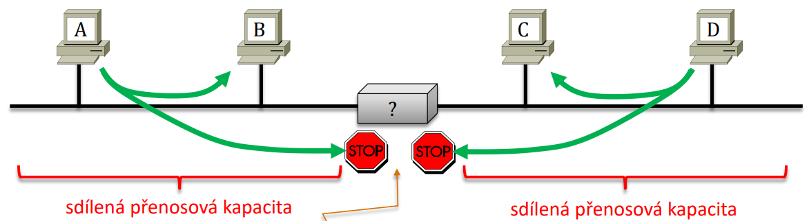

#### Forwarding

Provoz, který začíná v jednom segmentu a končí v jiném segmentu, není šířen do dalších segmentů.
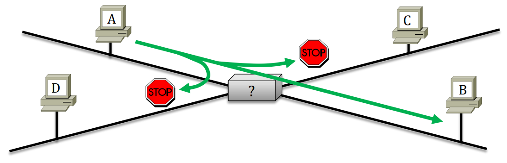

Propojovací uzel u Filtrování a cíleného forwardingu již nesmí fungovat jako repeater, ale musí fungovat minimálně na L2 (aby rozuměl struktuře přenášených rámců)

Důsledkem toho je efektivnější využití přenosové kapacity. Je ale potřeba znát částečně topologii sítě.

### (C11) Činnost linkového rozhraní

mosty a přepínače musí uložit do bufferu alespoň tolik dat (linkového rámce), aby dokázaly zjistit adresu odesílatele a příjemce → technika store&forward a cut-through

### (C12) Mechanismus Store&Forward

čeká se na načtení celého linkového rámce a teprve pak s ním pracuje

výhody:

- segmenty propojené mostem/přepínačem mohou pracovat s různou přenosovou rychlostí
- poškozené rámce se nešíří dále

nevýhody:

- vyšší latence

### (C13) Mechanismus Cut-Through

nečeká se na načtení celého rámce, ale začíná se s ním pracovat již po načtení jeho hlavičky (než se načte zbytek rámce, tak je úvodní část už přeposlaná dále)

výhody:

- nižší latence

nevýhody:

- segmenty propojené mostem/přepínačem nemohou pracovat s různou přenosovou rychlostí
- poškozené rámce se šíří dále

### (C14) Segmentace sítě

Síť se rozdělí na segmenty, propojené na L2 (ideálně lze při rozdělení na N segmentů využít Nx přenosovou kapacitu). Přenosová kapacita v rámci jednoho segmentu je sdílená (čím více uzlů v segmentu, tím vyšší šance na kolizi). Př. rozdělím na dva segmenty, pak je původní přenosová kapacita rozdělena na dvě sdílené přenosové kapacity, které mohou být ideálně využívány nezávisle na sobě

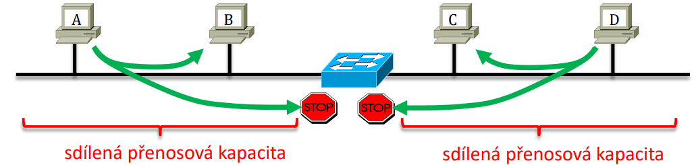

Velké segmenty tedy chceme ideálně rozdělit na větší počet menších segmentů a ty propojit dostatečně výkonnými přepínači. Ideální stav je mikrosgementace → segment = 1 uzel:

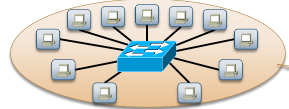

### (C15) Vyhrazená přenosová kapacita

Vyhrazená přenosová kapacita nastává ve chvíli, kdy došlo k mikrosegmentaci (segment = 1 uzel), tzn. každý uzel má celou přenosovou kapacitu svého segmentu pro sebe.

Podmínkou využití vyhrazené kapacity je dostatečná rychlost přepínače (musí stíhat přepínat/přenášet všechny souběžné přenosy → tzn. souběžné přenosy se nesmí navzájem zpomalovat). Vnitřní výpočetní kapacita přepínače musí odpovídat součtu přenosových kapacit všech segmentů.

### (C16) Propojovací zařízení na L2

#### Mosty

Pouze brání tomu, aby se provoz z jednoho segmentu zbytečně šířil do dalších segmentů → optimalizované na filtrování. Má většinou jen dva porty (propojí pouze dva segmenty), tudíž u něj nehraje moc roli forwarding.

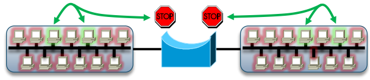

Dnes se skoro nepoužívají

#### Switche

má za úkol podporovat/vytvářet vyhrazenou přenosovou kapacitu → propojuje více segmentů s menším počtem uzlů. Většinou více než 50 portů → je optimalizován na forwarding (filtrování skoro nemusí nastat)

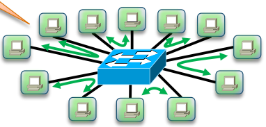

### (C17) Vlastnosti zařízení na L2

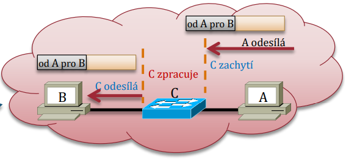

### (C18) Principy propojování na L3

Propojují se jednotlivé sítě pomocí routerů (směrovačů) → výsledkem propojení je soustava propojených sítí = internetwork = internet

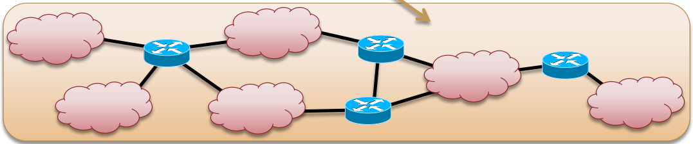

### (C19) Činnost síťového rozhraní

Směrovače jsou viditelné pro koncové uzly. Koncové uzly musí dokázat rozlišit mezi uzlem ve vlastní síti a uzlem v jiné síti. Posílá-li uzlu ve stejné síti, pak mu odesílá přímo (fakticky na L2). Pokud se nechází v jiné síti, pak svá data pošle (na L2) směrovači.

### (C20) Pravidla 80:20 a 20:80

#### 80:20

Pravidlo před nástupem internetu (dnes již neplatí) - uživatelé pracovali především s místními zdroji (se servery umístěnými v lokální místní síti).

- 80% provozu je v rámci lokální sítě
- 20% provozu opouští lokální síť

#### 20:80

S nástupem Internetu a cloud computingu se to obrátilo.

- 80% provozu opouští místní síť
- 20% provozu je v rámci místní sítě

V důsledku pravidla 20:80 významně rostou požadavky na celkovou propustnost směrovačů. Možná řešení je použití L3 přepínače (L3 switch) či nasazení VLAN

### (C21) Místní L2 broadcast

Připomenutí: Broadcast - příjemce jsou všechny uzly v rámci dané oblasti (broadcast domény - v praxi je to konkrétní síť).

Rozlišujeme několik druhů broadcastů → začneme L2 broadcastem

L2 broadcast se týká šíření rámců. Broadcast doménou je daná síť, tedy síť, ve které se nachází odesílatel. Tzn. mosty a přepínače propouští broadcast ale směrovače L2 boradcast zastavují.

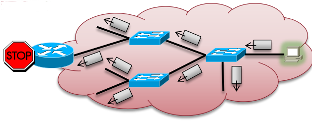

### (C22) Místní L3 broadcast

praktický efekt je stejný jako u L2 broadcastu. Týká se šíření paketů, zatímco L2 broadcast se týká šíření rámců → paket, odeslaný jako L3 broadcast, by měl být doručen všem uzlům v dané síti. V praxi se udělá to, že se paket vloží do linkového rámce a pošle se L2 broadcastem.

### (C23) Cílený L3 broadcast

Šíří se v zadané cílové síti, která je jiná, než je síť, ve které se nachází zdroj (odesílatel). V praxi je paket poslán jako unicast, je doručen až do cílové sítě. V cílové síti se z něj stává broadcastový paket a je doručen všem uzlům v cílové síti (zabalí se do linkového rámce a je droučen pomocí L2 broadcastu).

### (C24) Funkce směrovače

manipuluje pouze s linkovými rámci, které jsou adresovány pro něj. Př.:

1. A (v síti X → X.A) posílá něco B (v sítí Y → Y.B)
2. Vytvoří paket: odesílatel je X.A, příjemce je Y.B
3. Paket zabalí do rámce, příjemce je v jiné síti, proto pošle rámec směrovači, v rámci tedy nastaví příjemce na směrovač v dané síti (odesílatel A, příjemce C, označení sítě není potřeba, posílám to v rámci jedné sítě X)
4. Směrovač obdrží rámec, ten je adresován mu, proto ho rozbalí. Přečte síťovou adresu (Y → posíláme do sítě Y). Y je sousední síť, kterou směrovač propojuje s X
5. Paket opět vloží do linkového rámce. Linková adresa (nyní již v síti Y) příjemce je nastavená na B
6. V Y je rámec doručen k uzlu B

Tradiční komplexní zařízení umožňující směrování a přeposílání
Vhodné pro přechod mezi heterogenními prostředími

– je optimalizován na logické funkce
• směrování, aplikace přístupových práv, …..

jeho logické funkce jsou realizovány v SW

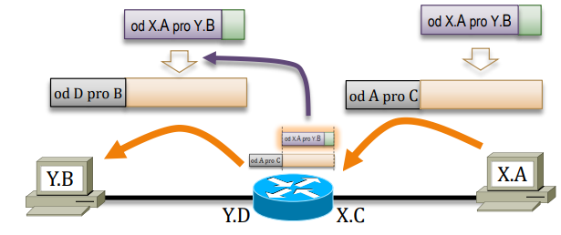

### (C25) Funkce L3 přepínače

Manipuluje s linkovými rámci, i když mu nejsou určeny.

1. A (v síti X → X.A) posílá něco B (v sítí Y → Y.B)
2. zachytí rámec
3. přečte linkovou adresu (nezkoumá další obsah)
4. odešle v daném směru nezměněný linkový rámec s původními linkovými adresami

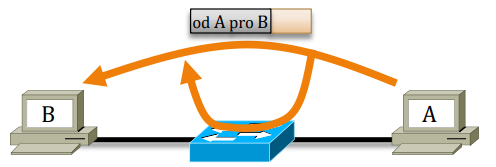

zjednodušená představa: je to běžný (L2) přepínač, doplněný o schopnost práce na L3

### (C26) Rozdíly směrovačů a L3 přepínačů

#### Směrovač

Funguje na principu _forward if not local_, tzn. Pokud nemá linkový rámec vyfiltrovat, pak ho pošle dál (forwarduje). Jestliže neví, kde se nachází příjemce, předá jej do všech odchozích segmentů.

- Vhodné pro přechod mezi heterogeními prostředími (napojení sítí LAN či MAN na WAN)
- má větší směrovací tabulky
- je optimalizován na logické funkce (směrování, aplikace přístupových práv...)
- není (tolik) optimalizován na rychlost a propustnost
- má (obvykle) větší buffery pro data
- může mít síťová rozhraní různých typů

#### L3 přepínač

funguje na principu _forward if proven distant_, tzn. síťový paket předává dál (forwarduje), pokud je určen vzdálenému uzlu a zároveň ví, kam jej poslat. Když ne, tak paket zahodí.

- Vhodné pro propojení mezi homogenního prostředími (propojení jednotlivých (L3) sítí v rámci LAN či MAN)
- má menší směrovací tabulky a buffery
- je optimalizován na rychlost a propustnost
  má obvykle jen ethernetová rozhraní

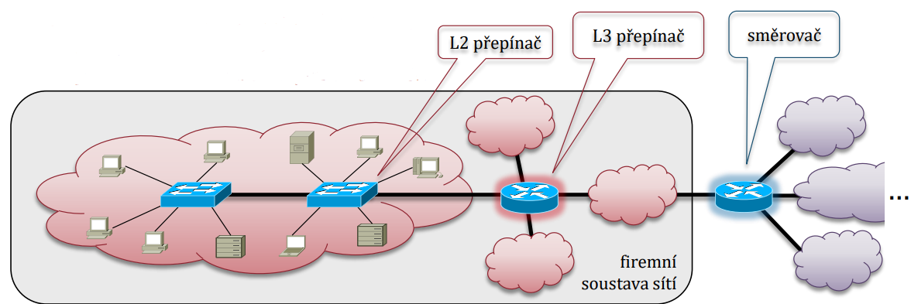

L3 přepínač
manipuluje se síťovými pakety, řídí se síťovými (L3) adresami (IP1 a IP2)
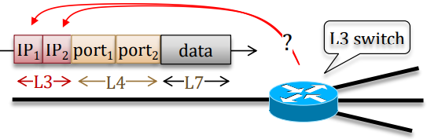

### (C27) Využití L4 a L7 přepínačů

L4 přepínače fungují na L3, manipulují se síťovými pakety, rozhodují se podle síťových (L3) adres i podle transportních (L4) adres (v TCP/IP: dle IP adres i dle čísel portů)

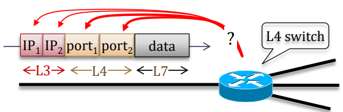

L7 přepínače fungují na L3, manipulují se síťovými pakety, rozhodují se podle síťových (L3) adres, podle transportních (L4) adres a také
podle aplikačních (L7) dat

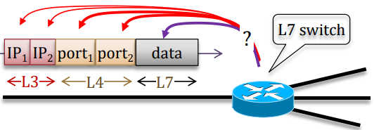

L4 a L7 přepínače se hodí pro 2 různé skupiny účelů:

Řízení datového provozu = různé zacházení s různými druhy
provozu (typicky podle cílového portu → př. multimedia mají přednost)

Rozdílné směrování - př. rozdělování požadavků na různé služby mezi servery, poskytující různé služby

### (C28) Principy a účel sítí VLAN

Situace bez VLAN: uzly musí být zařazovány do sítí podle toho, kde jsou fyzicky umístěny (Uzly, které tvoří L3 síť jsou navzájem viditelné a dosažitelné). Fyzické umístění nemusí korespondovat s logickými kritérii

Princip virtuální sítě (VLAN) - již neplatí, že to, co je propojeno na linkové vrstvě (L2), je jednou sítí (přepínač podporující VLAN může propojovat uzly, patřící do různých sítí)

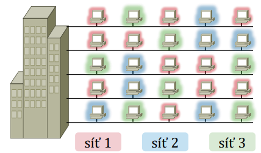
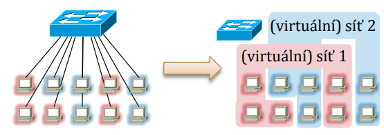

### (C29) Koncepty VLAN sítí

liší hlavně svým účelem a cílem

#### Lokální VLAN

- spojuje (řadí do jedné sítě) geograficky blízké uzly
- uzly v lokální VLAN síti nemusí mít společné zájmy

#### End-to-end VLAN

- spojuje (řadí do jedné sítě) geograficky rozptýlené uzly
- sdružuje uživatele se stejnými právy/zájmy/chováním/zařazením
- dělá se hlavně kvůli snadné správě uživatelů a nastavení přístupových práv

### (C30) Logický model VLAN sítě

- každá VLAN má přiřazené unikátní číslo - VLAN Identifier (VID) a také volitelné jméno

Typy segmentů zahrnuté do infrasttruktury:

- VLAN-unaware segmenty - uzly zprávě jedné VLAN
- VLAN-aware segmenty - uzly zprávě jedné VLAN

### (C31) Přístupové VLAN porty

propojuje VLAN-unaware segmenty

- označen přesně jedním VID
- rámce které:
  - přicházejí jsou označeny daným VID, jestliže už označené jsou, tak jsou propuštěny pouze pokud sedí VID
  - odcházejí, tak jim je odebráno označení

### (C32) Trunkovací VLAN porty

propojuje VLAN-aware segmenty

- označen jedním nebo více VID

### (C33) Konfigurace VLAN sítí

### (C34) Tagování 802.1q Dot1q

VLAN tag je přidán do původního ethernetového rámce mezi Source MAC a Type.

- TPID = Tag prodotocol identifier
- TCI = Tag control information - obsahuje VID

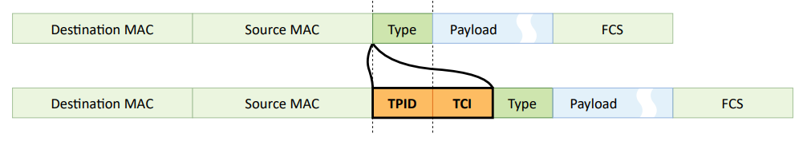

### (C35) Směrování mezi VLAN sítěmi

### (C36) Princip a typy firewallů

Úkolem internetworkingu je rovněž řízení přístupu (= aby se uživatel dostal pouze tam, kam má právo se dostat). Obecným řešením je firewall.

Firewall je tedy obecně řešení, které implementuje požadovaná pravidla přístupu (ale i odesílaných věcí). Může být realizován jako kombinace hardwaru/softwaru.

Může být buď spoečný (chrání celé sítě), nebo individuální (chrání jednoho uživatele).

Dva přístupy:

1. vše je blokováno, ale něco je povoleno - tzn. nejprve se vše zablokuje, a pak se povolí konkrétní "pozitivní" výjimky
2. vše je povoleno, ale něco je blokováno - tzn. nechá se vše povolené a následně se zakážou konkrétní "negativní" výjimky

### (C37) Demilitarizovaná zóna

obvyklé řešení pro firewally, fungující na principu „vše je zakázáno, něco je povoleno“. Mezi vnější sítí a vnitřní sítí se vytvoří ztv. demilitarizovaná zóna (DMZ). Ta není průchozí (je povolen pouze provoz, který začíná nebo končí uvnitř DMZ → tzn. vše jsme zakázali) → realizace pomocí konfigurace směrovacích tabulek v obou směrovačích oddělujících zóny.

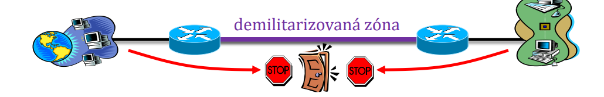

Aby byla umožněna komunikace s vnějším světem, umístí se do DMZ brány, které předávají povolený provoz.

### (C38) Aplikační brány

### (C39) Realizace DMZ

### (C40) Paketové filtry a ACL

## Adresy a adresování

Zpět na [Přehled](#přehled).

### (D01) Principy adresování na L2

Ethernetové (MAC) adresy. Používá se na L2 respektive na MAC sublayer.
nastaveny výrobcem
nedají se změnit
musí být unikátní v rámci jedné sítě.

### (D02) Adresy EUI-48 a EUI-64

= Extended Unique Identifier

EUI‐48 (48 bits)
Dříve označovaný jako MAC-48
6 hex čísel oddělených pomlčkou nebo dvojtečkou
př.: FC-77-74-19-41-1E nebo FC:77:74:19:41:1E
jsou dvousložkové - vyšší 3 byty představují identifikaci výrobce (OUI - každý výrobce má svou přidělenou organizací IEEE), nižší tři byty předatvují číslo síťového rozhraní (výrobní číslo)

EUI‐64 (64 bits)
novější verze
3 byty na OUI, 5 bytů na sériové číslo (40 bitů)
lze na ně převést EUI-48 přidáním FF-EE za OUI př.: FC-77-74-FF-FE-19-41-1E

### (D03) Principy adresování na L3

adresují se celé uzly (uzly jako celky)
síťová adresa musí vyjadřovat:

1. příslušnost ke konkrétní síti
2. relativní adresu uzlu v rámci dané sítě

síťové adresy (IP adresy) jsou proto 2-složkové

přesněji se IP adresy přidělují síťovým rozhraním uzlu. Koncové uzly (hosts) mají 1 rozhraní (1 IP adresu), směrovače mají více síťových rozhraní (a na každém 1 IP adresu)

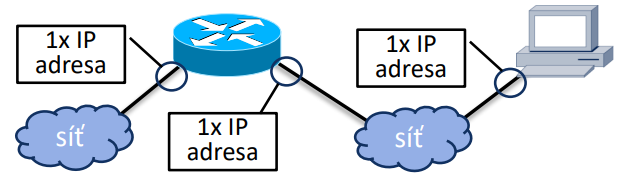

### (D04) Tvar a zápis IPv4 adres

4 byty (32 bitů).
zápis: 4 desítková čísla 0-255 (jedno pro každý byte) oddělená tečkou.
adresa rozdělena na dvě části: síťovou a relativní. Kde bude předěl? 3 možnosti → podle toho 3 třídy IPv4 adres:

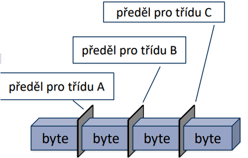

### (D05) Třídy a prostor IPv4 adres

| Třída A               | Třída B               | Třída C               |
| --------------------- | --------------------- | --------------------- |
| největší sítě         | středně velké sítě    | malé sítě             |
| relativní část 3 byty | relativní část 2 byty | relativní část 1 byte |
| nejvyšší bit 0        | nejvyšší bity 10      | nejvyšší bity 110     |
| síťová část 7 bitů    | síťová část 14 bitů   | síťová část 21 bitů   |
| 128 sítí              | $2^{14}$ sítí         | $2^{21}$ sítí         |
| 1/2 adres             | 1/4 adres             | 1/8 adres             |

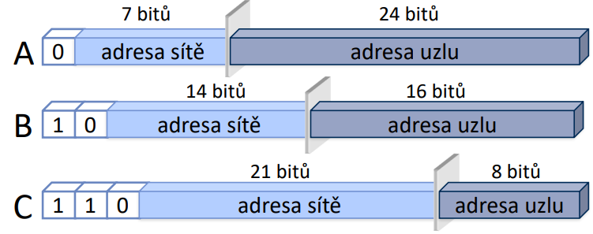

Třídy D a E:

- zbývající 1/8 adres
- třída D - [multicastové adresy](#d07-ipv4-multicastové-adresy). Nejvyšší bity 1110 → 1/16 adres
- třída E - pro budoucí rozšíření. Nejvyšší bity 1111 → 1/16 adres

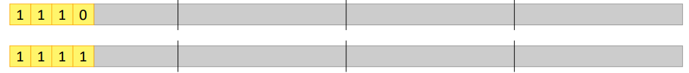

### (D06) Speciální IPv4 adresy

Některé IPv4 adresy mají speciální význam.
Základní princip:

- samé 0 = "this" (tento/default)
- samé 1 = "all" (všechno)

tento uzel

konkrétní uzel v "této" síti (pro verzi A, B, C)

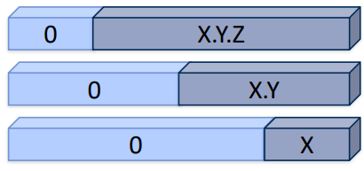

tato síť - tedy síť s adresou X.Y.Z.0 (pro verzi C). Tzn. síťová adresa je nastavená, ale relativní adresa ne. (je to první adresa v síti z celého bloku pro síť X.Y.Z.0)

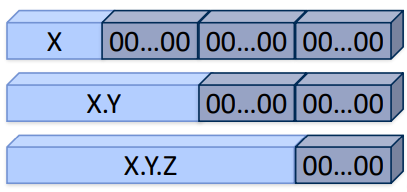

omezený broadcast (broadcast v této síti, není propuštěn směrovači dál
)

broadcast v konkrétní síti

loopback - většinou se používá 127.0.0.1, ale zabraná je pro to celá skupina 127.X.Y.Z

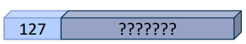

### (D07) IPv4 multicastové adresy

multicast = přenos od 1 zdroje k více příjemcům současně (unicast: od 1 k 1, broadcast: od 1 ke všem)

multicastová skupina jsou uzly, které přijímají vysílání příslušného zdroje. Může být vymezena:

- staticky - je dopředu a pevně definováno, které uzly jsou ve skupině
- dynamicky - uzly se zařazují / vyjímají ze skupiny dle potřeby

multicastová skupina je adresovaná (jednou) multicastovou IP adresou (IPv4 třídy D). Ta není rozdělena na síťovou a relativní část.

### (D08) Realizace multicastu na L2

### (D09) Přidělování IPv4 adres sítím

při přidělení IP adresy síťovému rozhraní musí být dodržen význam obou složek:

- pokud jsou dvě rozhraní ve stejné síti, musí mít IP adresy shodnou síťovou část a rozdílné relativní části
- pokud jsou dvě rozhraní v ruůzné síti, musí mít rozdílnou síťovou část, ale mohou mít klidně stejnou relativní část (ale nemusí)

proto musíme IP adresy přidělovat po celých blocích (všechny adresy se stejnou síťovou částí)

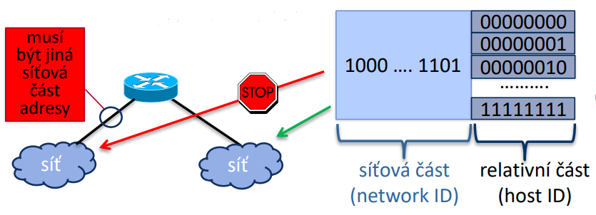

poznámka: kdyby měly různé sítě stejnou síťovou část, mátlo by to směrovací algoritmy, které by pak nevěděly kam poslat pakety. Tzn. nepoužíté adresy nemohou být použity nikým jiným.

Přidělovací strategie:

- kdysi - zájemce s potřebou X adres dostal „nejbližší vyšší blok“
- později - princip „více nejbližších menších bloků“

### (D10) Řešení nedostatku IPv4 adres

„nejbližší vyšší blok“ a „více nejbližších menších bloků“ se již nepoužívá → adresy docházely příliš rychle. Dnes dvě řešení

- Dočasná řešení - zpomalení úbytku → subneting, CIDR, privátní IPv4 (+NAT)
- Trvalá řešení - zvětšení adresového prostoru → IPv6

### (D11) Mechanismus subnettingu

Motivace: rozdělím blok IP adres na menší bloky. Menší bloky přidělím různým (pod)sítím (tzv. subnets). Rozdělení nesmí být viditelné zvenku, soustava (pod)sítí musí mít pouze jeden vstupní bod.

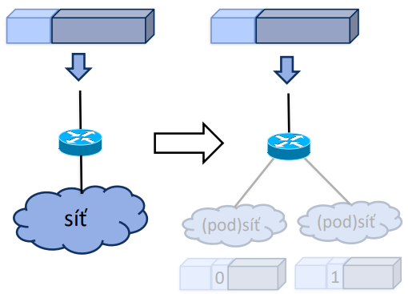

podstata subnettingu - předěl mezi síťovou a relativní částí IPv4 adresy se posouvá doprava (zvětšuje se síťová část adresy) → předěl není pevně dán. Jak tedy poznat předěl? použijeme síťovou masku.

Síťová maska má v první části 1 (1 = síťová část) a v druhé části 0 (0 = relativní část)

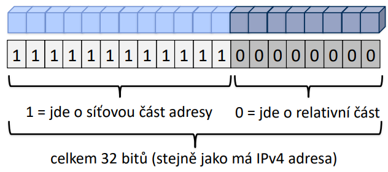

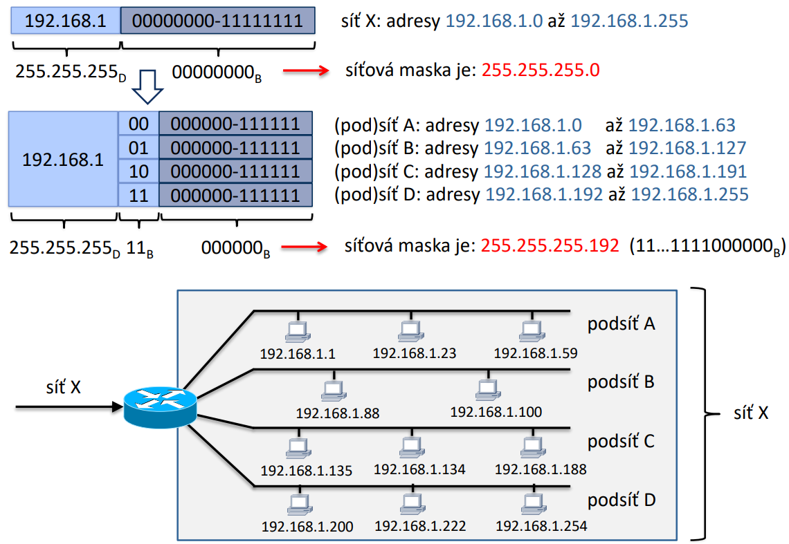

### (D12) Mechanismus supernettingu

z několika menších bloků IP adres uděláme jeden větší blok. Jde o posun předělu směrem doleva, k vyšším bitům.

Lze např. použít při přidělování "nejbližší nižší", kdy mi bylo přiděleno několik samostatných bloků.

podmínka - musí být vyčerpány všechny možné kombinace v těch bitech, přes které se předěl posouvá

### (D13) Mechanismus CIDR

motivace: dělení na třídy není transparentní - hlavně pro společnosti střední velikosti je 256 málo a 66000 adres moc. Cíl je zrušit koncept IPv4 tříd a přidělovat libovolně velké bloky.

Zavedeme CIDR bloky. Předěl může být kdekoliv → CIDR prefix (číslo udávající počet bitů síťové části). Zápis CIDR bloků: X.Y.Z.W/prefix, například 192.168.0.0/16

Princip umožňuje dělit CIDR bloky na menší (a analogicky lze i spojovat). Mějme např. alokovaný blok 195.113.19.0/24. Ten může být rozdělen např. na:

- Network A: 195.113.19.0/25 (i.e.,195.113.19.00000000B/25)
- Network B: 195.113.19.128/26 (i.e.,195.113.19.10000000B/26)
- Network C: 195.113.19.192/26 (i.e.,195.113.19.11000000B/26)

Poznámka: Mechanismus CIDR je (na rozdíl od subnetingu) viditelný pro celý internet. Může být rovněž zachován koncept tříd → třídy A/B/C odpovídají CIDR bolkům s prefixy 8/16/24

### (D14) Hierarchie registrátorů

CIDR umožňuje vznik hierarchie přidělovatelů - vyšší dostane větší CIDR blok, který rozdělí na menší CIDR bloky a sám je přidělí
nižším přidělovatelům (případně koncovým uživatelům).

- Správcem 32-bitového prostoru IPv4 adres byla organizace IANA
- Vznikly RIR (Regional Internet Registry) - velcí regionální přidělovatelé IPv4 adres - dostávali od IANA větší počty bloků, které pak sami přidělují. Dnes jich je pět (Afrika, Evropa, Asie a Austrálie, Severní Amerika, JIžní Amerika)
- NIR - Národní přidělovatelé (od RIR dostávají větší CIDR bloky) → ne vždy tato vrstva v hierarchii je
- LIR - typicky ISP (poskytovatelé internetu) - dostávají od RIR popř. NIR větší CIDR bloky a přidělují je koncovým zákazníkům (většinou jednotlivé IP adresy)

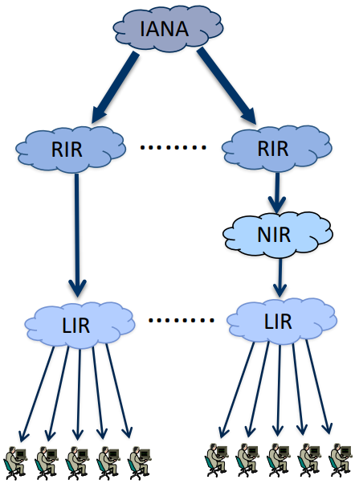

### (D15) Závislost IP adres na ISP

Přidělování IP adres pomocí CIDR učinilo IP adresy závislé na způsobu připojení (ISP). páteřní směrovače znají pouze cesty k největším CIDR blokům → nižší směrovače již mají informace o rozdělení (některých) CIDR bloků na menší CIDR bloky.

### (D16) Koncept privátních IP adres

Připomenutí: ve veřejném Internetu musí mít každý uzel (rozhraní) unikátní IP adresu (kvůli směrování)

Myšlenka: stejné IP adresy lze využít opakovaně v sítích, které
nejsou zvenku vidět (privátní sítě). Nutno zabránit šíření informací o dostupnosti privátních adres - př. firewall (L7 gateways) nebo NAT

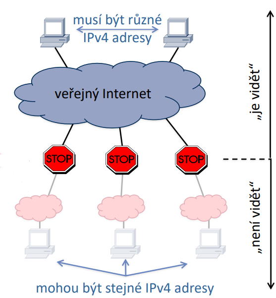

### (D17) Princip překladu adres

NAT (překlad adres) funguje na síťové vrstvě - pracuje s IP datagramy

Odchozí přenosy:

1. vnitřní uzel pošle IP datagram - adresa odesílatele je privátní adresa uzlu
2. datagram je zachycen routrem a je aplikován NAT - zdrojová adresa je nahrazena veřejnou adresou routeru
3. upravený datagram je odeslán do veřejné sítě

Příchozí přenosy:

4. Odpověď od příjemce je doručena zpět na veřejnou IP adresu routeru
5. odpověď je zachycena routerem a cílová adresa je nahrazena původní privátní adresou
6. modifikovaná odpověď je odeslaná do privátní sítě

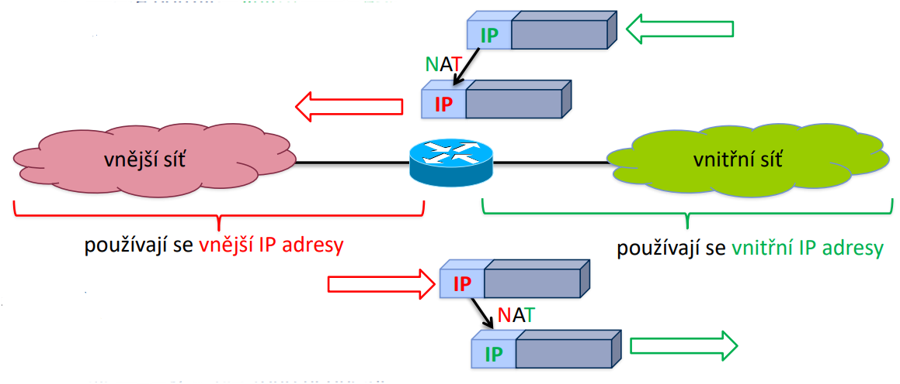

### (D18) Způsob fungování NAT

### (D19) Charakter NAT/PAT vazeb

### (D20) Princip a vlastnosti PAT

### (D21) Způsob fungování PAT

### (D22) Varianty chování NAT/PAT

### (D23) Problémy NAT/PAT

/

### (D24) Cíle návrhu IPv6 adres

hrozba vyčerpání adresového prostoru IPv4 adres (poprvé v roce 1990). IPv4 jsou v protokolu IP příliš hluboce zakořeněny na to, aby se daly změnit. Proto bylo nutné vyvinout nový protokol IP (IPv6) a s ním změnit některé věci z původního protokolu IPv4.

Cíle:

- primární cíl je zvětšit adresový prostor
- více úrovní hierarchie adres
- snazší přidělování IPv6 adres
- anycastové adresy
- odstranění broadcast adres

### (D25) Vztah IPv4 a IPv6 adres

neexistuje kompatibilita mezi IPv4 a IPv6 - tzn. zařízení IPv4 a IPv6 nejsou schopna vzájemně komunikovat přímo.

interoperabilita mezi IPv4 a IPv6 je možná (ale složitá). Možnosti:

- dual stack - každý uzel podporuje IPv4 i IPv6
- překlad - mezi IPv4 datagramy a IPv6 pakety
- tunelování - pakety IPv6 jsou vkládány do IPv4 datagramů a přenášeny přes IPv4 síť

### (D26) Tvar a zápis IPv6 adres

IPv6 adresy se zapisují po 16-bitových slovech, každé je vyjádřeno hexadecimálně. Př. 805b:2d9d:dc28:0000:0000:fc57:d4c8:1fff (8x 16 bitů)

Zkracování zápisu:

- nulová slova se zkrátí na jedinou číslici: 805b:2d9d:dc28:0:0:fc57:d4c8:1fff
- nulová slova se vynechají: 805b:2d9d:dc28::fc57:d4c8:1fff
- pro „vkládání“ IPv4 adres do IPv6 → posledních 32 bitů se zapíše jako u IPv4: ::212.200.31.255

### (D27) Základní druhy IPv6 adres

Existují tři základní druhy:

1. unicast (individuální) adresy - identifikují vždy jedno síťové rozhraní, komunikace probíhá s tímto rozhraním
2. Multicast (skupinové) adresy - identifikují (multicastovou) skupinu uzlů, komunikace probíhá se všemi uzly ve skupině
3. anycast (výběrové) adresy - identifikují skupinu uzlů, komunikace probíhá jen s jedním uzlem ve skupině

### (D28) Dělení IPv6 unicast adres

1. global unicast - veřejné IPv6 adresy, musí být unikátní v celém Internetu
2. local unicast - individuální privátní adresy, platné i pro více (pod)sítí
3. link local - individuální „privátní“ adresy, platné jen pro danou (pod) síť
4. site local - lokální místní adresy (nemají se již používat)

### (D29) Globální IPv6 unicast adresy

Adresa má 3 části:

1. (globální směrovací) prefix
2. identifikátor podsítě (subnet ID)
3. identifikátor rozhraní (interface ID)

„koncovým bodem“ pro (globální) směrování jsou jednotlivá **místa** (skupina (pod)sítí pod jednou společnou správou). Směrovací algoritmy ve veřejném Internetu hledají cesty jen k jednotlivým místům (určené prefixem) v rámci veřejné topologie. Poté, co najdou místo, tak si další doručení v rámci skupiny podsítí řeší správce místa sám (pomocí indetifikátoru podsítě) v rámci místní topologie. A nakonec v podsíti je pomocí identifikátoru rozhraní doručen obsah ke konkrétnímu interfacu

### (D30) Principy adresování na L4

připomenutí: na L3 (i na vrstvě síťového rozhraní) se adresují uzly jako celky (nedokážeme rozlišit různé entity v rámci téhož uzlu)

Adresování na L4 potřebuje rozlišit různé entity v rámci daného uzlu, ale nepotřebuje identifikovat uzel jako celek. Proto použijeme pouze porty (abstraktní adresy).

### (D31) Porty a jejich číslování

port je 16-biotvé číslo. Systém registrovaných portů spravuje IANA

typy portů:

- systémové porty (Well Known Ports) (0 – 1023) - porty 0 až 1023, s pevně daným významem, př. HTTP (80), HTTPS (443), ...
- uživatelské porty (Registered Ports) (1024 – 49151) - opět určeny pro speciální účel, ale mohou být použity i pro něco jiného
- Dynamic Ports (Private Ports) (49152 – 65535) - neoznačené, dostupné pro nespecifikované účely

### (D32) Principy adresování na L7

je třeba identifikovat různé typy objektů (texty, obrázky, videa, ...
)

možnosti adresování:

- nezávisle na umístění objektu - identifikuje se objekt jako takový, nezávisle na jeho umístění. V TCP/IP URN
- v závislosti na umístění objektu - součástí identifikace (adresy) je i umístění objektu. V TCP/IP - URL (Uniform Resource Locator)

### (D33) Obecná struktura URI

= Uniform Resource Identifier - obecný systém pojmenovávání.

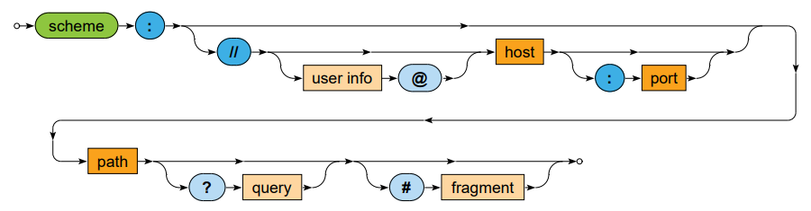

obecný tvar:

- schéma
- autorita
  - uživatelské info (jméno, heslo → dnes již deprecated)
  - host - doménové jméno, IP adresa
  - port - port na L4
- cesta (path)
- query - často parametry formuláře
- fragment - např. id na HTML stránce

příklady:

- HTTP schéma
  - př. http://www.earchiv.cz
  - adresy webových stránek nebo jiných zdrojů
- FTP schéma
  - ftp://sunsite.mff.cuni.cz/Network/RFCs/rfc-index-latest.txt
  - cesty k souborům nebo adresářům pomocí FTP protokolu
- mailto schéma
  - mailto:jiri@peterka.cz
  - emailové adresy zahrnující další parametry

## Protokoly IPv4 a IPv6

Zpět na [Přehled](#přehled).

### (D34) Vlastnosti protokolu IPv4

- univerzální
  - snaží se fungovat „nad vším“
  - nevyužívá specifika přenosových technologií vrstvy síťového rozhraní
  - snaží se zakrýt odlišnosti
- pracuje s virtuálními pakety
  - nemají ekvivalent v HW, musí se zpracovávat v SW
  - říká se jim IP (zatímco u IPv6 se hovoří o paketech) datagramy, protože se přenáší nespojovaně
- je zaměřen na jednoduchost, efektivnost a rychlost
  - je nespojovaný - nečísluje přenášené datagramy, negarantuje, pořadí doručení, negarantuje dobu doručení
  - funguje jako nespolehlivý - negarantuje doručení, negarantuje nepoškozenost dat, nepoužívá potvrzení, nepodporuje řízení toku
- je „síťově neutrální“ - pracuje stylem best effort, nepodporuje QoS

### (D35) Struktura IPv4 datagramu

datagram má dvě hlavní části - hlavičku a tělo

- hlavička má proměnnou velikost (délka musí být násobky 4B, minimum je 20B). Údaj o délce hlavičky = IHL
- tělo (datová část) - proměnná velikost - nutný údaj o velikosti = Total length (zahrnuje těli i hlavičku). Max velikost 64kB

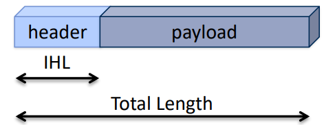

poznámka - datagram nemá patičku s kontrolním součtem, kontrolní součet se provádí pouze v hlavičce, integritu užitečných dat si musí zajistit "ten komu data patří"

### (D36) Položky IPv4 hlavičky

celkem 14 položek - 13 povinných + 1 volitelná

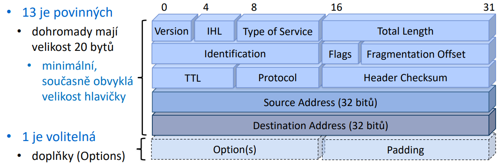

- version - dnes 4 IPv4
- IHL - velikost hlavičky v jednotkách 32 bitů (typicky 5 → 5x 32 bitů)
- Type of Servise (TOS) - nikdo neví porč to tam je
- Total length - celková délka (v B) datagramu (včetně hlavičky)
- identification, flags a fragmentation offset - pouze pro potřey fragmentace (nedochází-li k ní, jsou položky zbytečné)
- protocol - udává typ dat v těle datagramu (1=ICMP, 6=TCP, 17=UDP, ...)

### (D37) IPv4 Time to Live

Omezuje dobu, po kterou má daný datagram existovat - dnes se jedná o počet přeskoků. Doporučená počáteční hodnota → 64. Každý router po cestě sníží hodnotu o 1 (a přepočítá kontrolní součet). Když je hodnota 0, je datagram zničen (odesílatel je informován pomocí ICMP)

### (D38) Nástroj TraceRoute

vynulování TTL může být provedeno záměrně → nsátroj traceroute. TTL je nastaveno na 1, další směrovač sníží na 0 a pošle ICMP. Čímž zjistíme adresu "dalšího uzlu". Poté nastavíme na 2 atd.

TraceRoute je diagnostický nástroj, která hledá sekvenci routerů na cestě k zadanému cílovému uzlu.

### (D39) IPv4 kontrolní součet

zajišťuje integritu hlavičky (nezahrnuje tělo datagramu). Výpočet:

1. hlavička se rozdělí na posloupnost 16-bitových slov (bez položky kontrolního součtu)
2. slova posčítáme
3. z výsledku uděláme jedničkový doplněk → zapíšeme do pole pro kontrolní součet

V případě, že nastane carry (součet bude delších než 16 bitů), zarovnáme to na 16 bitů a přičteme 1 (případně lze provést až na konci celého součtu).

#### Konkrétní příklad

sčítáme pouze povinná pole (20B - jsou zvýrazněná). Pole checksum (b861) se nepřičítá. Mějme následující hlavičku:

`4500` `0073` `0000` `4000` `4011` `b861` `c0a8` `0001`
`c0a8` `00c7` 0035 e97c 005f 279f 1e4b 8180

sečteme klasickým sčítáním 16-bitová slova:

`4500` + `0073` + `0000` + `4000` + `4011` + `c0a8` + `0001` + `c0a8` + `00c7` = `2479c`

První cifra je carry - odebereme a přičteme k součtu:

`2` + `479c` = `479e`

provedeme jedničkový doplněk:

~`479e` = `b861`

zapíšeme výsledek kontrolního součtu `b861` do určeného pole.

Ověření kontrolního součtu v cíli - provedeme stejným způsobem výpočet součtu (včetně pole pro kontrolní součet) → výsledek musí dát nula (v checksum je negace součtu → ~N+N=0). Jestliže nedá, paket je zničen, ale přijemce není informován prostřednictvím ICMP (protože mohla být poškozená adresa odesílatele).

### (D40) IPv4 doplňky hlavičky

Umožňují specifikovat dodatečné informace. Dnes se moc nepoužívají. Mohou mít různou velikost

- typ doplňku (Option Type), 1 byte
- délku doplňku (Option Length), žádný nebo 1 byte
- data doplňku (Option Data), žádný nebo více bytů
  Struktura:

Příklady doplňků:

- Record Route - kudy datagram prochází (každý směrovač, přes který datagram prochází, vloží do jeho hlavičky svou IP adresu)
- Timestamp - zaznamenává čas průchodu jednotlivými směrovači
- Source Routing - v hlavičce IP datagramu je vložena posloupnost směrovačů, kudy datagram bude procházet

### (D41) Principy IPv4 fragmentace

Technologie síťového rozhraní pracují s rámci omezené velikosti (IP datagram může být větší) → mohli bychom omezit velikost datagramů → ne vždy je to ale možné → po cestě mohou být IP datagramy vkládány do linkových rámců různé velikosti a různé technologie pracují s různě velkými rámci (ethernet II by to vložil do většího ramce, než je Ethernet 802.3 schopen pojmout)

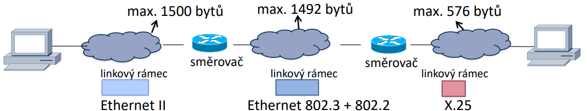

MTU = maximální povolená "nákladová" část (bez hlavičky) linkového rámce.

řešení: Rozdělíme příliš velký IP datagram na menší datagramy (fragmenty). Měli bychom se tomu ale vyhýbat jako čert křiži. U IPv4 může fragmentovat ktreýkoliv uzel po cestě (včetně směrovačů), u IPv6 pouze odesílající uzel.

### (D42) IPv4 varianty detekce MTU

Jak předejít fragmentaci MTU?

1. neomezovat velikost IP datagramů - vhodné jen jako poslední možnost, protože tento způsob většinou povede k fragmentaci
2. garantované minimum - máme garantované, že datagram určité délky lze vždy přenést bez fragmentace (v praxi u IPv4 → 576 B)
3. řídit se místním MTU - nemusí vždy stačit (můžeme narazit na menší MTU po cestě)
4. řídit se Path MTU - nákladné, navíc nemusí vždy stačit (IP je nespojovaný → skutečná data mohou jít jinou cestou)

### (D43) IPv4 Path MTU Discovery

Path MTU („MTU po celé cestě“) = minimum přes všechna MTU
od zdrojového uzlu až po cílový. Path MTU se dá zjistit pomocí Path MTU discovery.

Datagramy jsou opakovaně posílány s nastaveným dont fragment flagem (viz dále) na true. Vždy, když by měl být datagram fragmentován, zahodí se, odesílatel obdrží ICMP zprávu a pošle datagram znovu s menší velikostí MTU → problém je, že sice víme, že MTU měla být menší, ale nevíme, jak moc menší měla být, proto musíme tipnout, jak moc je potřeba zmenšit nový datagram. Tento proces opakujeme, dokud datagram nedorazí do cíle.

### (D44) Proces IPv4 fragmentace

datová část (ne hlavička) paketu je rozdělena na fragmenty → z fragmentů jsou vytvořeny nové datagramy → hlavičky jsou vytvořeny jako kopie původní hlavičky (a změněny příslušná pole)

### (D45) IPv4 fragmentační hlavičky

Identifikace:

- V položce Identification mají fragmenty stejnou
  hodnotu jako původní datagram (poznáme, že patří k sobě)
- nebyl-li fragemntován, tak není definován

Fragmentation offset:

- udává offset (posun) začátku datové části fragmentu oproti datové části původního datagramu v násobcích 8

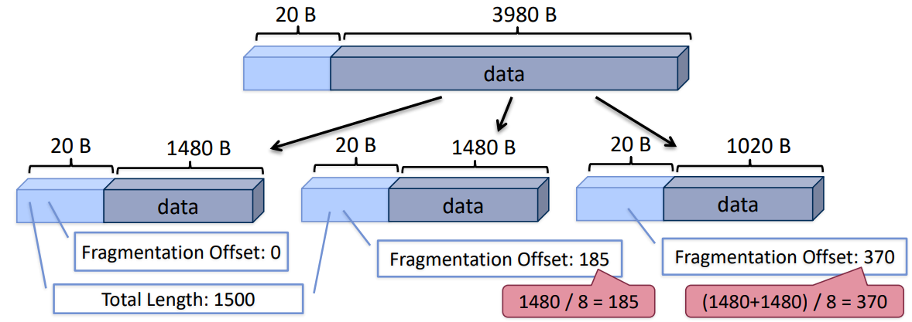

Příznaky fragmentace (celkem 3 bity):

- první bit je fixně 0
- dont fragment flag - požadavek na to, aby datagram nebyl
  fragmentován, i když by to bylo zapotřebí (nelze pokračovat v přenosu → datagram je zahozen → posláno info odesílateli). Používá se při Path MTU discovery
- more fragments - udává, zda jde o poslední fragment

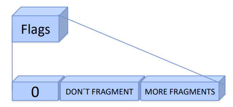

### (D46) Proces IPv4 defragmentace

Jednotlivé fragmenty skládá zpět (do původního datagramu) koncový příjemce (žádný jiný uzel nemusí mít k dispozici všechny fragmenty). Fragmenty do cíle nemusí dorazit ve stejném pořadí (dokonce ani ne všechny). Proto jsou příchozí fragmenty strčeny do bufferu. Jestliže do časového úseku nejsou doručeny všechny, vše je zahozeno. Odesílatel je informován prostřednictvím ICMP time exceeded message

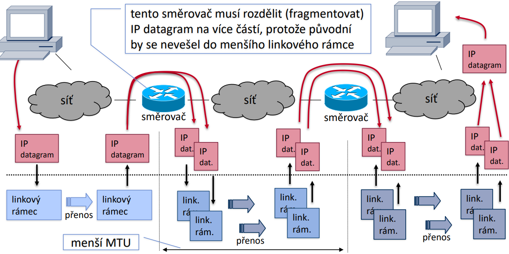

### (D47) Problémy IPv4 de/fragmentace

- celý koncept musí být podporován všemi uzly
- netriviální overhead především u zpětného sestavování
- nepřijde-li jeden fragment, celý datagram je zahozen
- IP protokol je bezstavový (nemá časové limity, čekání apod.) - čekání na fragmenty tento princip porušuje

### (D48) Principy protokolu ICMPv4

protokol (součást L3), který umožňuje řešit chyby a nestandardní situace (IP to nezvládá) pomocí posílání zpráv.

Dva typy zpráv:

1. Chybové zprávy (Error message)
2. Informáční zprávy (informational message)

ICMP zprávy jsou určené i pro příjemce v jiných sítích, proto je nutné umět zprávy směrovat → ICMP zpráva se vloží do IP datagramů.

### (D49) Struktura ICMPv4 zprávy

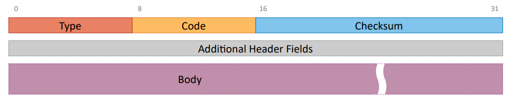

- Hlavička - fixní délky 64 bitů
  - type - typ ICMP zprávy
  - code - podtyp, upřesňuje druh zprávy
  - checksum - kontrolní součet celé zprávy (i těla, stejný výpočetní mechanismus jako pro IP)
  - doplňkové pole hlavičky - většinou chybí, pouze pro určitý typ zprávy
- Tělo - může klidně chybět. Př. u chybových zpráv obsahuje hlavičku datagramu, kterého se zpráva týká a prvních 8 bytů jeho těla (datové části)

### (D50) Příklady ICMPv4 zprávy

příklady ICMP zpráv:

- Time Exceeded - vypršený čas
- Destination Unreachable - nedosažitelný cíl
- Source Quench - hrozí zahlcení
- Redirect - přesměrování
- Echo Request/Reply - testování dostupnosti

### (D51) Principy protokolu ARP

slouží potřebám převodu IP adres na HW (linkové) adresy. Fungují jen v dané síti (nepřekračují hranice).

- uzel A zná IP adresu uzlu B, a potřebuje znát jeho HW adresu
- sestaví ARP zprávu (L3), ve které uvede IP adresu uzlu B (+ svou IP a HW adresu)
- zprávu vloží do linkového rámce (L2) a pomocí (linkového) broadcastu
  rozešle jako dotaz po celé síti, ve které se nachází
- uzel B rozpozná svou IP adresu a odpoví
- sestaví ARP zprávu obsahující jeho HW adresu a pošle ji unicastem uzlu A

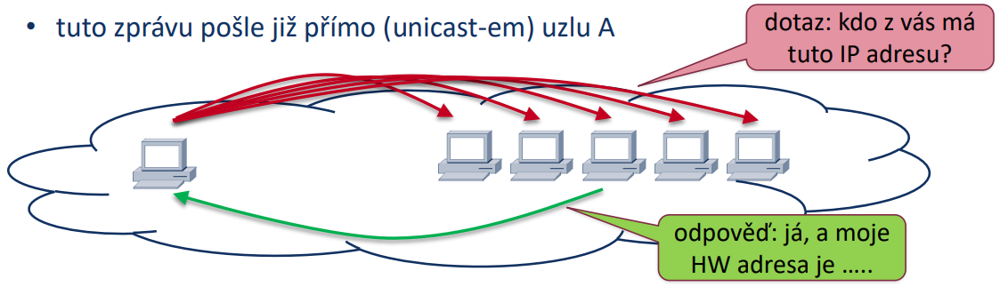

### (D52) Struktura ARP zprávy

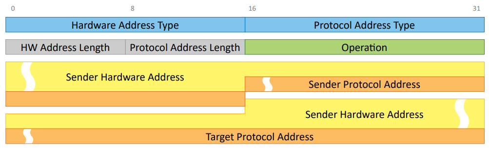

- Hardware Address Type a Length - typ a délka L2 adresy (popisuje L2 technologii), př. ethernet → typ 1, délka 6 B, ...
- Protocol Address Type a Length - typ a délka L3 adres (definuje L3 protokol), př. IPv4 → typ 0x0800, délka 4 B
- Operation - Umožňuje rozlišit jednotlivé operace ARP (Request = 1, Reply = 2, ...)
- Sender Hardware Address a Sender Protocol Address - L2 HW adresa a L3 IP adresa odesílatele, kterou vyplní odesílatel při dotazu
- Target Hardware Address a Target Protocol Address - L2 (vyplní uzel, který odpovídá na dotaz) a L3 IP adresa příjemce (na kterou se odesílatel ptá → vyplní odesílatel při dotazu)

Odpověď:

1. změní se operation code z request na reply
2. prohodí se source a target adresy
3. doplní se zdrojová HW adresa

### (D53) Princip ARP cachování

Vyrovnávací paměť, ve které si ARP pamatuje výsledky převodů IP → HW (tzv. resolution). jde o tabulku, kde jsou informace o vazbách mezi IP a HW adresami (tzv. bindings)

Vazby mohou být:

- statické
- dynamické - musí být pravidelně zapomínány (aby reflektovaly změny v síti) a obnovovány (aby se omezovaly nové dotazy)

### (D54) Zpracování ARP dotazu

situace: uzel A zná IP adresu uzlu B, a potřebuje znát jeho HW adresu

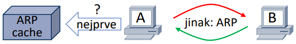

1. uzel A se podívá do své ARP cache - pokud zde najde HW adresu k IP adrese uzlu B, končí
2. uzel A sestaví a rozešle (linkovým broadcastem) ARP zprávu s dotazem
3. každý uzel v síti zachytí ARP zprávu (vysílanou broadcastem).Zaprvé vyjme ze zprávy vazbu mezi IP a HW adresu uzlu A a uloží si ji do cache (případně, pokud už ji v cachi má, tak ji prodlouží). Zadruhé zjistí, zda je uzlem B → pokud ne, ARP zprávu zahodí a končí. Pokud ano, sestaví sestavá ARP zprávu s odpovědí.

### (D55) Reverzní ARP protokol

Lze prohodit fungování a provádět převod HW adresa → IP adresa. Tedy uzel zná svou HW adresu a chtěl by znát svou IP adresu.

1. uzel A nezná svou IP adresu, sestaví RARP zprávu (stejnný formát jako ARP s drobnými změnami)
2. uezl A uloží RARP zprávu do linkového rámce a rozešle broadcastem po místní síti
3. uzel D, který funguje jako RARP server odpoví pomocí unicastu (pkud je RARP serverů více, odpoví kterýkoliv z nich)

### (D56) Nevýhody RARP protokolu

- je starý a velmi jednoduchý
- funguje na L3
- dotazy se šíří pomocí linkového broadcastu (nefunguje v sítích bez broadcastu)
- RARP server musí být v každé síti
- obsah RARP serveru musí být nastaven manuálně
- přiděluje se pouze IP adresa (a ne žádné další parametry)

### (D57) Koncept protokolu DHCP

založen na BOOTP (bootstrap protocol).

- Jeden DHCP server může obshluhovat několik sítí
- může přidělovat IP adresy dynamicky (na omezenou dobu – s možností
  následně přidělit stejnou IP adresu jinému uzlu) → nejčastější varianta. Dalšími variantami je ruční a trvalé přiřazení
- funguje na L7

### (D58) DHCP alokační strategie

#### Ruční (statická) přidělení

správce sítě předepíše, jakou IP adresu má dostat konkrétní uzel s danou HW adresou → DHCP pak adresu v podstatě jenom předá

#### trvalá (automatická) alokace

IP adresu určí DHCP server sám, a přidělí ji trvale na neomezenou dobu ze seznamu dostupných adres

#### Dynamická alokace

IP adresu určí DHCP server sám, a přidělí ji na omezenou dobu ze seznamu dostupných adres. Omezená doba = tzv. DHCP lease (DHCP pronájem) je specifikovaná v době pronájmu (př. hodina, den, ...).

### (D59) Chování DHCP klienta

- alokace: klient nemá IP adresu a žádá DHCP server o pronájem IP adresy
- realokace: klient již má pronajatou IP adresu, ale snaží se pronájem potvrdit (př. byl vypnut, ale doba pronájmu stále trvá) → tímto krome je vlastně ochoten přijmout novou adresu
- obnova: před koncem pronájmu se snaží o prodloužení (poprvé v polovině doby pronájmu)
- rebinding: snaží se získat pronájem stejné IP adresy od jiného DHCP serveru pokud se nepodařila obnova (v 87.5% doby pronájmu)
- uvolnění: klient vrací pronajatou IP adresu ještě před koncem jejího pronájmu

### (D60) Rozdíly IPv6 oproti IPv4

- jednodušší formát paketu (méně polí v hlavičce)
- rozšiřující hlavičky jsou úspornější a efektivnější
- povinná podpora multicastu
- fragmentovat může jen odesílající uzel
- modernější směrování (lepší podpora hiearchického směrování)
- zabudovaná podpora bezpečnosti (IPSEC)
- popdpora pro alokaci zdrojů a QoS

### (D61) Struktura IPv6 paketu

Má více hlaviček - jednu povinnou fixní délky a další rozšiřující. Nepovinné tělo.

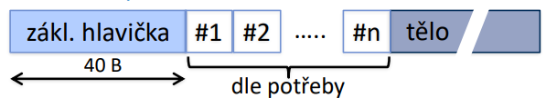

### (D62) Položky IPv6 hlavičky

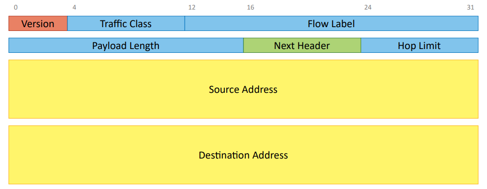

- version - fixní hodnota
- Traffic Class - nahrazuje byte ToS v IPv4 datagramu
- Flow Label - umožňuje identifikovat příslušný proud (flow). Cílem je podpora QoS (př. různé nakládání s pakety podle toho, do kterého toku patří)
- payload lenght - velikost nákladu (nezahrnuje základní hlavičku, zahrnuje rozšiřující hlavičky)
- Next Header - nejsou-li přítomny rozšiřující hlavičky, tak udává typ nákladu (jako Protocol u IPv4), jsou-li přítomny, udává typ první z nich
- Hop Limit - analogie k Time to Live z IPv4

### (D63) Koncept IPv6 toků

tok = skupina paketů, které spolu nějak souvisí (stejný odesilatel i příjemce + stejný význam/smysl)

v IPv6 je tok identifikován zdrojovou IPv6 adresou a identifikátorem toku (není potřeba analyzovat směrovačem data v těle paketu).

### (D64) IPv6 rozšiřující hlavičky

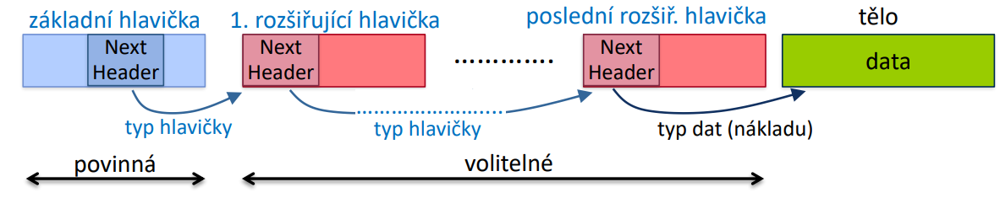

rozšiřující hlavičky jsou nepovinné, nahrazují options v IPv4. Jsou řazené v sérii za sebou. Položka Next Header udává typ další rozšiřující hlavičky (poslední hlavička udává typ nákladu v těle paketu). Typy v podstatě odpovídají typům z IPv4. První položkou rozšiřujících hlaviček je vždy next header položka.

př.: Typ 44 - fragmentační hlavička.

### (D65) IPv6 fragmentační hlavička

V IPv6 může fragmentovat pouze odesílající uzel. Aby se pokusil vyhnout fragmentaci může:

1. posílat pakety o velikosti max 1280 B (garantované doručení)
2. pomocí MTU path Discovery najít nejmenší MTU po cestě

Pokud narazí směrovač na paket, který by měl být fragmentován, zahodí ho.

Inforamce o fragmentaci jsou uložené ve speciální fragmentační hlavičce. Fragment Offset - stejně jako Fragmentation Offset u IPv4 (posunutí vůči začátku datové části původního paketu) Identification - stejné jako u IPv4

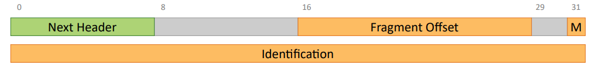

### (D66) IPv6 Path MTU Discovery

postup zjišťování (nejmenšího) MTU po cestě od daného uzlu ke zvolenému cíli

1. zdrojový uzel odešle paket o velikosti místního MTU
2. pokud paket kvůli velikosti neprojde, dostane zdroj zpět ICMPv6 zprávu Packet Too Big (obsahuje potřebnou velikost MTU)
3. použije novou (nižší) hodnotu MTU a celý postup opakuje

### (D67) Formát ICMPv6 zprávy

protokol ICMPv6 slouží ke stejnému účelu jako ICMP u IPv4 (signalizaci nestandardních situací).

zprávy ICMPv6 se přenáší uvnitř IPv6 paketů (Next Header = 58)

ICMPv6 zprávy mohou být:

- chybové (Type = 0 až 127)
- informační (Type = 128 až 255)

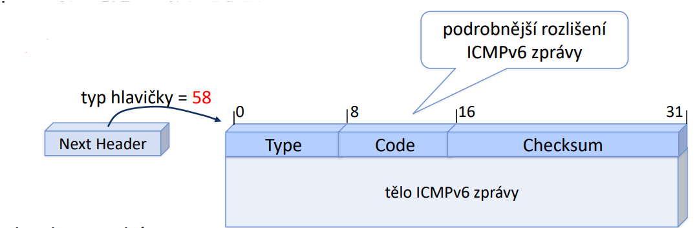
